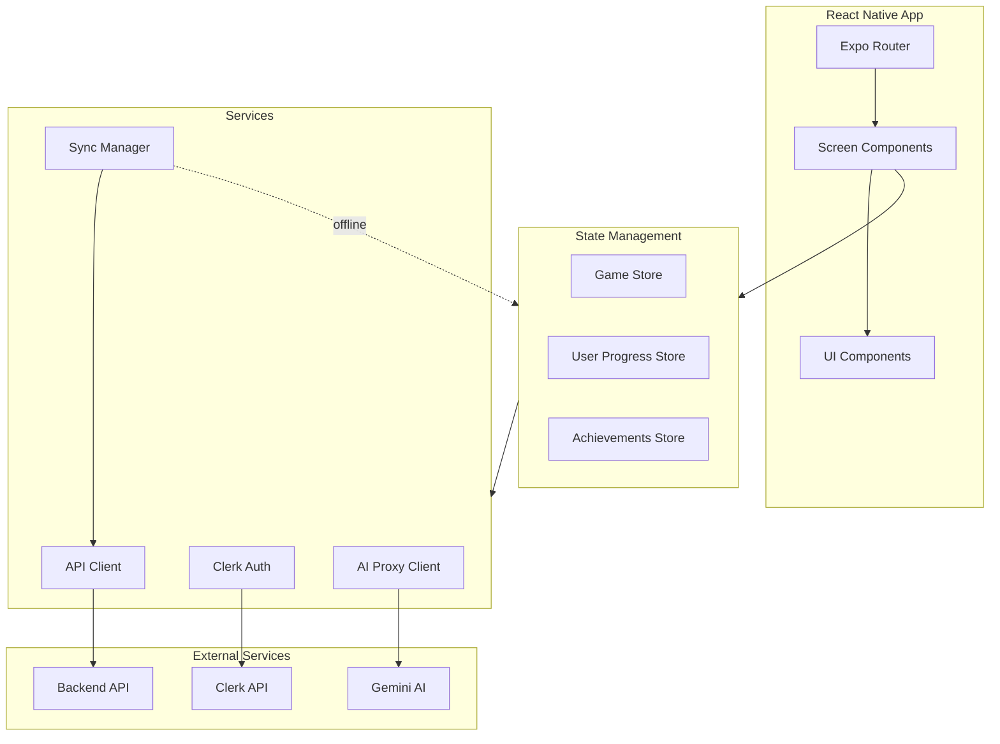
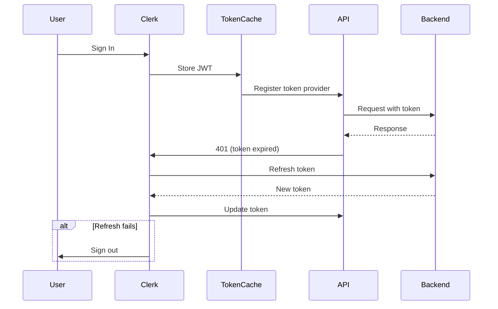
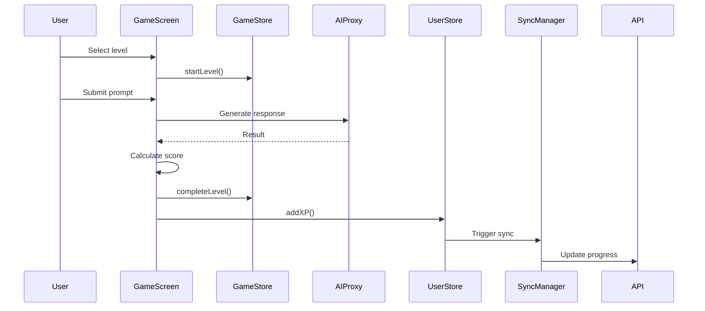
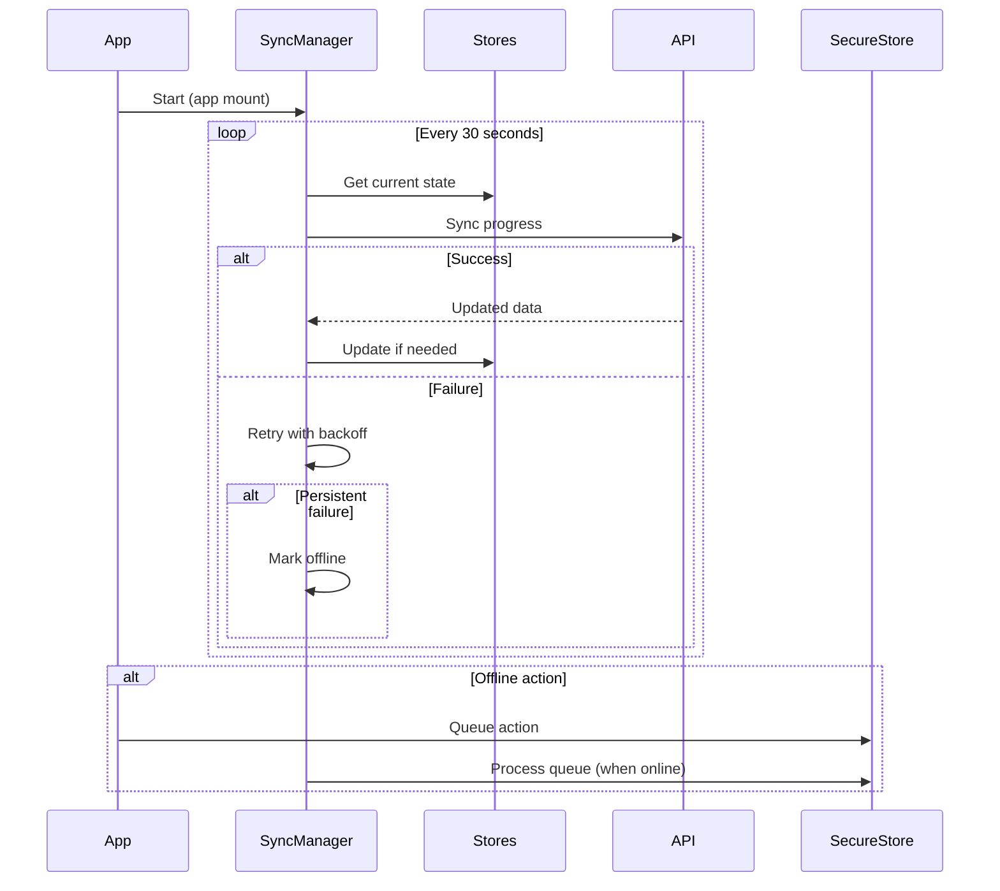

# Codebase Map

> Auto-generated by Cartographer. Last mapped: 2026-01-25

## System Overview

PromptPal is a gamified AI prompt engineering learning app built with React Native/Expo. Users complete challenges in three domains (image generation, coding, copywriting) to earn XP, maintain streaks, and climb leaderboards.



## Directory Structure

```
PromptPal/
├── src/
│   ├── app/                    # Expo Router screens & layouts
│   │   ├── (auth)/            # Authentication flow (sign-in, sign-up)
│   │   ├── (tabs)/            # Main tab navigation
│   │   │   ├── game/         # Challenge gameplay screens
│   │   │   │   └── levels/   # Module level selection
│   │   │   ├── index.tsx     # Home dashboard
│   │   │   ├── library.tsx   # Learning modules
│   │   │   └── ranking.tsx   # Leaderboard
│   │   ├── _layout.tsx       # Root layout with providers
│   │   └── global.css        # Global styles
│   ├── components/            # React components
│   │   ├── ui/               # Reusable UI components
│   │   └── [other components]
│   ├── features/             # Feature-based state & data
│   │   ├── achievements/     # Achievement tracking
│   │   ├── game/            # Gameplay state
│   │   ├── levels/          # Level definitions (fallback)
│   │   └── user/            # User progress & XP
│   └── lib/                  # Utilities & services
│       ├── api.ts           # Backend API client
│       ├── aiProxy.ts       # AI generation client
│       ├── gemini.ts        # Gemini service wrapper
│       ├── auth*.ts*        # Authentication utilities
│       ├── syncManager.ts   # Background sync
│       └── [other utilities]
├── docs/                     # Documentation
├── __tests__/               # Unit tests
├── e2e/                     # E2E tests
└── [config files]
```

## Module Guide

### App Navigation (src/app/)

**Purpose**: Expo Router file-based navigation with auth-protected routes

| File | Purpose | Tokens |
|------|---------|--------|
| `_layout.tsx` | Root layout with providers, error boundary | 413 |
| `(auth)/_layout.tsx` | Auth flow layout (sign-in, sign-up) | 303 |
| `(auth)/sign-in.tsx` | Login screen with Google/Apple | 2449 |
| `(auth)/sign-up.tsx` | Registration screen | 3585 |
| `(tabs)/_layout.tsx` | Tab navigation (floating tab bar) | 627 |
| `(tabs)/index.tsx` | Home dashboard with stats & quests | 3226 |
| `(tabs)/library.tsx` | Learning modules & resources | 2235 |
| `(tabs)/ranking.tsx` | Global leaderboard | 2576 |
| `(tabs)/game/[id].tsx` | Challenge gameplay screen | 3406 |
| `(tabs)/game/levels/[moduleId].tsx` | Level selection within module | 1612 |

**Key Patterns**:
- Auth redirect logic in both `(auth)` and `(tabs)` layouts
- Floating tab bar design with absolute positioning
- Game screens hidden from tab bar
- Fallback to local data when API fails

### UI Components (src/components/)

**Purpose**: Reusable presentational components

| File | Purpose | Tokens |
|------|---------|--------|
| `ui/Button.tsx` | Button with variants & loading state | 590 |
| `ui/Input.tsx` | Text input with error states | 452 |
| `ui/Modal.tsx` | Reusable modal with backdrop | 390 |
| `ui/Card.tsx` | Container with elevation variants | 314 |
| `ui/Badge.tsx` | Label/status indicator | 217 |
| `ui/ProgressBar.tsx` | Progress indicator | 121 |
| `ui/RadarChart.tsx` | Spider chart for metrics | 810 |
| `ui/ResultModal.tsx` | Challenge results display | 787 |
| `ui/ResourceModal.tsx` | Learning resource modal | 1547 |
| `ui/Skeleton.tsx` | Loading placeholder | 45 |
| `ErrorBoundary.tsx` | React error boundary | 210 |
| `SignOutButton.tsx` | Sign out with confirmation | 257 |
| `UsageDisplay.tsx` | API usage statistics | 950 |
| `GoogleIcon.tsx` | Google logo SVG | 541 |

**Exports**: Centralized in `ui/index.ts`

**Dependencies**: React Native, NativeWind (Tailwind)

### State Management (src/features/)

**Purpose**: Zustand stores with secure persistence

| File | Purpose | Tokens |
|------|---------|--------|
| `game/store.ts` | Lives, score, unlocked/completed levels | 967 |
| `user/store.ts` | XP, level, streak, modules, quests | 2326 |
| `achievements/store.ts` | Achievement unlocks (in-memory) | 402 |
| `levels/data.ts` | Static level definitions (fallback) | 726 |

**Exports**:
- `useGameStore` - Game state & actions
- `useUserProgressStore` - User progress & backend sync
- `useAchievementsStore` - Achievement tracking
- Helper functions for level data

**Dependencies**: Zustand, expo-secure-store

**Patterns**:
- Persist middleware with custom storage adapter
- Backend sync on progress updates
- Rehydration triggers backend data load

### Library & Services (src/lib/)

**Purpose**: API clients, auth, sync, and utilities

| File | Purpose | Tokens |
|------|---------|--------|
| `api.ts` | Backend API client with retry | 3415 |
| `aiProxy.ts` | AI generation client (text/image) | 1941 |
| `gemini.ts` | High-level Gemini service | 1106 |
| `auth.ts` | Clerk token cache | 144 |
| `clerk.tsx` | Clerk provider wrapper | 220 |
| `auth-sync.tsx` | Token provider registration | 898 |
| `auth-diagnostics.ts` | Auth issue tracking | 567 |
| `session-manager.ts` | Centralized session callbacks | 461 |
| `syncManager.ts` | Background sync (30s interval) | 1280 |
| `network.ts` | Network connectivity monitoring | 118 |
| `rateLimiter.ts` | Client-side rate limiting | 904 |
| `usage.ts` | Usage statistics calculation | 643 |
| `logger.ts` | Centralized logging | 370 |
| `constants.ts` | App-wide constants | 102 |
| `env.ts` | Environment validation | 396 |
| `theme.ts` | Theme configuration | 527 |
| `thumbnails.ts` | Module thumbnail mapping | 408 |

**Key APIs**:
- `ApiClient` - Backend communication (levels, progress, leaderboard)
- `AIProxyClient` - AI generation (text, image, comparison)
- `SyncManager` - Background sync with offline queue

## Data Flow

### Authentication Flow



### Gameplay Flow



### Background Sync Flow



## Conventions

### Naming
- Screen components: Default export in `index.tsx` or `[param].tsx`
- UI components: PascalCase, export from `ui/index.ts`
- Stores: `use{Domain}Store` (Zustand convention)
- Utilities: camelCase files, default export or named exports

### State Management
- Zustand for global state
- Persist middleware with expo-secure-store
- Actions use `set()` for immutable updates
- Backend sync triggered on state changes

### API Patterns
- Singleton clients (`ApiClient`, `AIProxyClient`)
- Request interceptor for auth tokens
- Response interceptor for 401 handling
- Exponential backoff retry (3 attempts)
- 10s timeout (30s for AI calls)

### Styling
- NativeWind (Tailwind for React Native)
- HSL color variables
- Floating tab bar with absolute positioning
- Platform-specific adjustments

## Gotchas

### Authentication
- Tokens can expire mid-session → auto refresh on 401
- Failed refresh triggers auto sign-out (5s debounced)
- Session health checks every 5 minutes
- Token cache uses SecureStore (silent failure handling)

### State Persistence
- SecureStore can fail silently → catch with empty return
- Store rehydration uses initial state if corrupted
- **Achievements are NOT persisted** (in-memory only)
- Lives reset when starting a level

### API Integration
- Empty responses fall back to local data
- Response format varies (`{data}` vs direct)
- Legacy API uses `/api`, new uses `/api/v1`
- Client-side rate limiting is in-memory only

### Navigation
- Game screens hidden from tab bar (`href: null`)
- Auth layouts redirect authenticated/unauthenticated users
- `router.back()` used extensively

### Styling
- Custom tab bar requires absolute positioning
- Platform-specific bottom padding for safe areas
- Skeleton loading states throughout

## Navigation Guide

**To add a new screen**:
1. Create file in `src/app/(tabs)/` or appropriate route group
2. Add to tab bar in `src/app/(tabs)/_layout.tsx` (if tab)
3. Implement navigation in `src/components/ui/index.ts` (if needed)

**To add a new stateful feature**:
1. Create store in `src/features/{feature}/store.ts`
2. Add persist middleware if needed
3. Import in components with `use{Feature}Store()`

**To add a new API endpoint**:
1. Add method to `src/lib/api.ts` (ApiClient class)
2. Update type definitions if needed
3. Add retry/error handling via interceptors

**To modify authentication**:
1. Token handling: `src/lib/auth.ts`, `src/lib/auth-sync.tsx`
2. Session callbacks: `src/lib/session-manager.ts`
3. Auth diagnostics: `src/lib/auth-diagnostics.ts`
4. Provider wrapper: `src/lib/clerk.tsx`

**To add AI capabilities**:
1. Add endpoint to `src/lib/aiProxy.ts`
2. Create high-level method in `src/lib/gemini.ts`
3. Update rate limits in `src/lib/rateLimiter.ts`

## Environment Variables

**Required**:
- `EXPO_PUBLIC_CLERK_PUBLISHABLE_KEY` - Clerk authentication
- `EXPO_PUBLIC_AI_PROXY_URL` - AI proxy backend URL

**Optional**:
- `EXPO_PUBLIC_API_URL` - Backend API URL (defaults to localhost:3000)

Validated on app startup via `src/lib/env.ts`.

## Tech Stack

| Category | Technology |
|----------|------------|
| Framework | React Native + Expo |
| Navigation | Expo Router (file-based) |
| State | Zustand |
| Auth | Clerk (expo-secure-store) |
| HTTP | Axios |
| Styling | NativeWind (Tailwind) |
| Storage | expo-secure-store |
| AI | Gemini 2.5 Flash (via proxy) |
