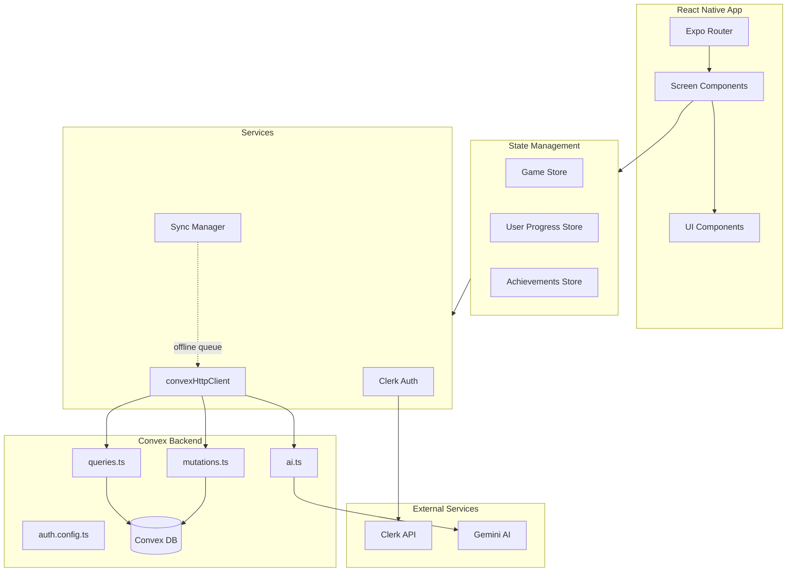
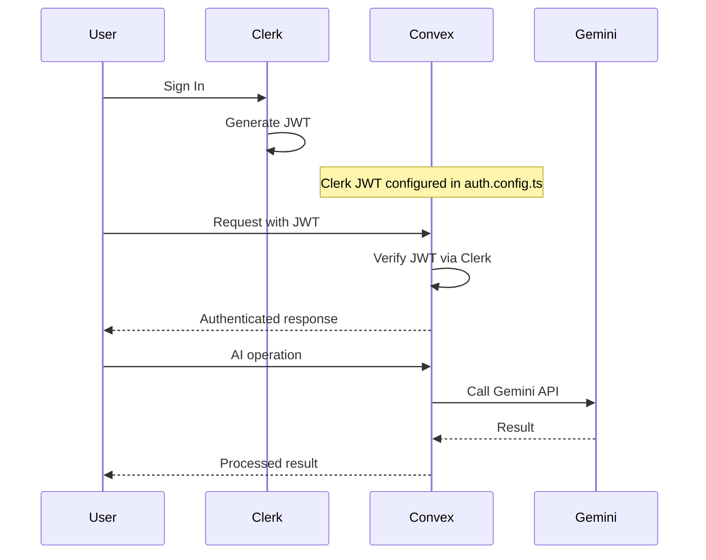
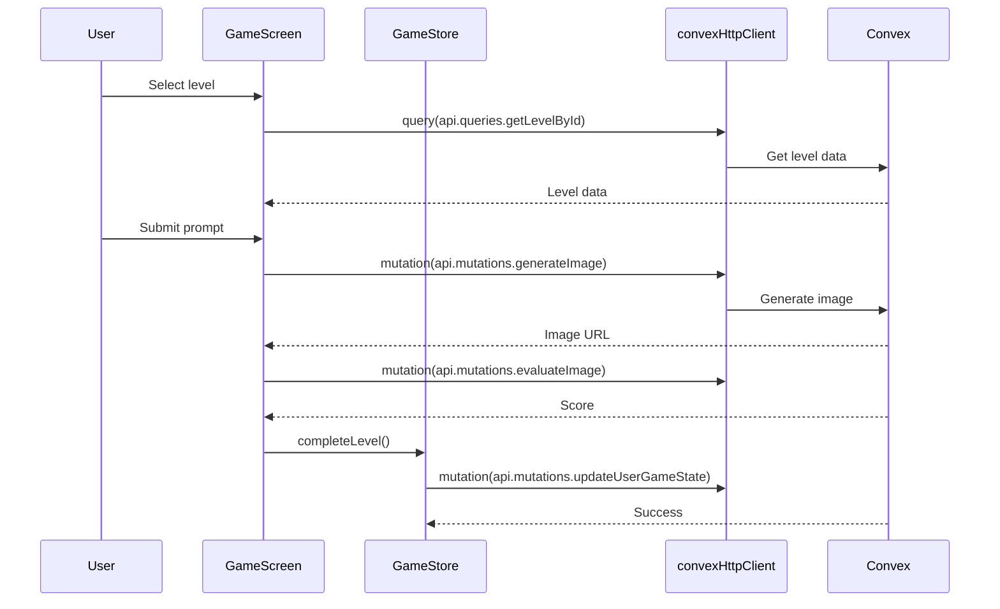
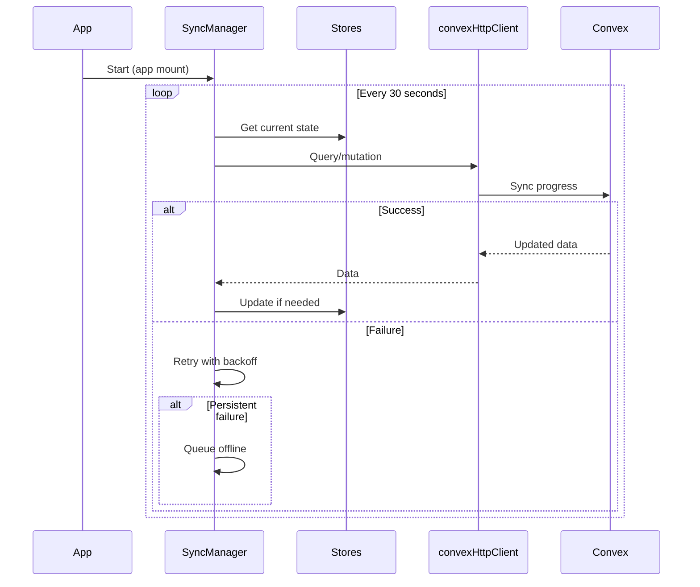

# Codebase Map

> Auto-generated by Cartographer. Last mapped: 2026-02-03  
> **Status**: Migrated to Convex (100% Complete)

## System Overview

PromptPal is a gamified AI prompt engineering learning app built with React Native/Expo and Convex. Users complete challenges in three domains (image generation, coding, copywriting) to earn XP, maintain streaks, and climb leaderboards.

**Backend**: Convex (serverless)  
**Authentication**: Clerk with JWT  
**AI**: Google Gemini via Convex mutations  
**State**: Zustand (local) + Convex (server)



---

## Migration Status

### ✅ Complete Migration (February 2026)

| Component | Before | After | Status |
|-----------|--------|-------|--------|
| **Backend API** | Proxy Server | Convex Functions | ✅ Migrated |
| **HTTP Client** | Axios (`unified-api.ts`) | `convexHttpClient` | ✅ Migrated |
| **Auth Tokens** | Manual management | Clerk JWT + Convex auto-auth | ✅ Migrated |
| **Data Fetching** | REST endpoints | Convex queries | ✅ Migrated |
| **AI Operations** | Proxy endpoints | Convex mutations | ✅ Migrated |
| **Legacy Files** | `api.ts`, `unified-api.ts` | Deleted | ✅ Cleaned |

### Migration Guide

📖 **Full migration guide**: [docs/CONVEX_MIGRATION.md](docs/CONVEX_MIGRATION.md)

---

## Directory Structure

```
PromptPal/
├── convex/                    # ⭐ Convex Backend (NEW)
│   ├── queries.ts            # Read operations
│   ├── mutations.ts          # Write operations
│   ├── ai.ts                 # AI operations (Gemini)
│   ├── auth.config.ts        # Clerk JWT configuration
│   ├── schema.ts             # Database schema
│   └── _generated/           # Auto-generated types
├── src/
│   ├── app/                   # Expo Router screens & layouts
│   │   ├── (auth)/            # Authentication flow
│   │   ├── (tabs)/            # Main tab navigation
│   │   │   ├── game/         # Challenge gameplay
│   │   │   ├── index.tsx     # Home dashboard
│   │   │   ├── library.tsx   # Learning modules
│   │   │   └── ranking.tsx   # Leaderboard
│   │   └── _layout.tsx       # Root layout
│   ├── components/            # React components
│   │   └── ui/              # Reusable UI components
│   ├── features/             # Feature-based modules
│   │   ├── achievements/
│   │   ├── game/
│   │   ├── levels/
│   │   └── user/
│   └── lib/                  # Utilities & services
│       ├── convex-client.ts  # ⭐ Convex HTTP client
│       ├── auth*.ts         # Auth utilities
│       ├── syncManager.ts   # Background sync
│       └── usage.ts         # Usage tracking (Convex hooks)
├── docs/                     # Documentation
│   ├── CODEBASE_MAP.md      # This file
│   └── CONVEX_MIGRATION.md  # Migration guide
└── [config files]
```

---

## Module Guide

### 🎯 Convex Backend (`convex/`)

**Purpose**: Serverless backend functions with automatic reactivity

| File | Purpose | Tokens |
|------|---------|--------|
| `queries.ts` | Read operations (getLevels, getLeaderboard, getUserStats) | 32468 |
| `mutations.ts` | Write operations (updateProgress, completeLevel, checkQuota) | 28377 |
| `ai.ts` | AI operations (generateImage, evaluateImage, generateText) | 8318 |
| `auth.config.ts` | Clerk JWT verification config | 489 |
| `schema.ts` | Database schema definitions | 16479 |
| `_generated/api.ts` | Auto-generated TypeScript types | Auto |

**Key Patterns**:
- Use `query()` for reads (automatically cached)
- Use `mutation()` for writes (automatically synced)
- Access auth via `ctx.auth.getUserIdentity()`
- Database via `ctx.db.query()` / `ctx.db.insert()` / `ctx.db.patch()`

**Example**:
```typescript
// convex/queries.ts
export const getLevels = query({
  args: {},
  handler: async (ctx) => {
    return await ctx.db.query("levels").collect();
  }
});
```

---

### 📱 App Navigation (`src/app/`)

**Purpose**: Expo Router file-based navigation with auth-protected routes

| File | Purpose | Tokens |
|------|---------|--------|
| `_layout.tsx` | Root layout with Convex provider, error boundary | 413 |
| `(auth)/_layout.tsx` | Auth flow layout (sign-in, sign-up) | 303 |
| `(auth)/sign-in.tsx` | Login with Google/Apple | 2449 |
| `(auth)/sign-up.tsx` | Registration | 3585 |
| `(tabs)/_layout.tsx` | Tab navigation (floating tab bar) | 627 |
| `(tabs)/index.tsx` | Home dashboard with stats | 3226 |
| `(tabs)/library.tsx` | Learning modules (uses Convex) | 2235 |
| `(tabs)/ranking.tsx` | Global leaderboard (uses Convex) | 2576 |
| `(tabs)/profile.tsx` | User profile (uses Convex) | 3410 |
| `(tabs)/game/[id].tsx` | Challenge gameplay (uses Convex) | 3406 |
| `(tabs)/game/levels/[moduleId].tsx` | Level selection (uses Convex) | 1612 |

**Key Patterns**:
- Use `useQuery()` from Convex for reactive data
- Use `convexHttpClient` for imperative data fetching
- Auth redirect in layout files
- Game screens hidden from tab bar

---

### 🎨 UI Components (`src/components/`)

**Purpose**: Reusable presentational components

| File | Purpose | Tokens |
|------|---------|--------|
| `ui/Button.tsx` | Button variants & loading | 590 |
| `ui/Input.tsx` | Text input with error states | 452 |
| `ui/Modal.tsx` | Reusable modal | 390 |
| `ui/Card.tsx` | Container with elevation | 314 |
| `ui/Badge.tsx` | Label/status indicator | 217 |
| `ui/ProgressBar.tsx` | Progress indicator | 121 |
| `ui/RadarChart.tsx` | Spider chart | 810 |
| `ui/ResultModal.tsx` | Challenge results | 787 |
| `ui/ResourceModal.tsx` | Learning resource modal | 1547 |
| `ErrorBoundary.tsx` | React error boundary | 210 |
| `SignOutButton.tsx` | Sign out action | 257 |
| `UsageDisplay.tsx` | API usage stats | 950 |

**Exports**: Centralized in `ui/index.ts`

---

### 🗃️ State Management (`src/features/`)

**Purpose**: Zustand stores with secure persistence + Convex sync

| File | Purpose | Tokens |
|------|---------|--------|
| `game/store.ts` | Lives, score, unlocked/completed levels | 967 |
| `user/store.ts` | XP, level, streak, modules, quests | 2326 |
| `achievements/store.ts` | Achievement unlocks | 402 |
| `levels/data.ts` | Static level definitions | 726 |

**Exports**:
- `useGameStore` - Game state & Convex sync
- `useUserProgressStore` - User progress & backend sync
- `useAchievementsStore` - Achievement tracking

**Patterns**:
- Persist with `expo-secure-store`
- Sync to Convex on state changes
- Use `convexHttpClient` for background operations

**Example**:
```typescript
// Sync XP to Convex
addXP: async (amount) => {
  set({ xp: newXP });
  await convexHttpClient.mutation(api.mutations.updateUserXP, {
    appId: "prompt-pal",
    totalXp: newXP
  });
}
```

---

### 🔧 Library & Services (`src/lib/`)

**Purpose**: Convex client, auth, sync, and utilities

| File | Purpose | Tokens | Status |
|------|---------|--------|--------|
| `convex-client.ts` | ⭐ Convex HTTP client with auth | ~150 | **NEW** |
| `auth.ts` | Clerk token cache | 144 | Updated |
| `clerk.tsx` | Clerk provider wrapper | 220 | Unchanged |
| `auth-sync.tsx` | Auth monitoring | ~300 | Simplified |
| `syncManager.ts` | Background sync to Convex | 1280 | Updated |
| `usage.ts` | Usage tracking with Convex hooks | ~150 | **NEW** |
| `gemini.ts` | Gemini service (now uses Convex) | ~400 | Updated |
| `scoring/*.ts` | Scoring services (now use Convex) | ~2000 | Updated |
| `logger.ts` | Centralized logging | 370 | Unchanged |
| `env.ts` | Environment validation | 396 | Updated |

**Deleted Files**:
- ❌ `api.ts` - Old axios client
- ❌ `unified-api.ts` - Legacy API wrapper
- ❌ `aiProxy.ts` - Old AI proxy client

---

## Data Flow

### Authentication Flow (New)



### Gameplay Flow (New)



### Background Sync Flow



---

## Convex Patterns

### Pattern 1: React Component with Real-time Data

```typescript
// In your screen/component
import { useQuery } from "convex/react";
import { api } from "../../convex/_generated/api";

function LeaderboardScreen() {
  // Automatically reactive - updates when data changes
  const data = useQuery(api.queries.getLeaderboard, { limit: 50 });
  
  if (data === undefined) return <Loading />;
  
  return <FlatList data={data.leaderboard} ... />;
}
```

### Pattern 2: Service/Store with Imperative Calls

```typescript
// In services or Zustand stores
import { convexHttpClient } from "@/lib/convex-client";
import { api } from "../../convex/_generated/api";

class MyService {
  async fetchData() {
    return await convexHttpClient.query(
      api.queries.getMyData, 
      { appId: "prompt-pal" }
    );
  }
  
  async updateData(value: string) {
    return await convexHttpClient.mutation(
      api.mutations.updateMyData,
      { appId: "prompt-pal", value }
    );
  }
}
```

### Pattern 3: Optimistic Updates

```typescript
// Update UI immediately, then sync
const updateProgress = async (newProgress: number) => {
  // Optimistic update
  setProgress(newProgress);
  
  try {
    // Sync to backend
    await convexHttpClient.mutation(
      api.mutations.updateModuleProgress,
      { appId: "prompt-pal", moduleId, progress: newProgress }
    );
  } catch (error) {
    // Revert on failure
    setProgress(oldProgress);
    logger.error("Sync failed:", error);
  }
};
```

---

## Conventions

### Naming
- **Screen components**: Default export in `index.tsx` or `[param].tsx`
- **UI components**: PascalCase, export from `ui/index.ts`
- **Stores**: `use{Domain}Store` (Zustand convention)
- **Convex functions**: camelCase, descriptive names
- **Utilities**: camelCase files, default/named exports

### State Management
- **Local state**: Zustand with `expo-secure-store` persistence
- **Server state**: Convex queries/mutations
- **Actions**: Use `set()` for immutable updates in Zustand
- **Sync**: Automatic via `convexHttpClient` in store actions

### API Patterns
- **Convex queries**: Use `useQuery()` in React, `convexHttpClient.query()` in services
- **Convex mutations**: Use `convexHttpClient.mutation()`
- **Auth**: Automatic via `setAuth()` in `convex-client.ts`
- **Error handling**: Try-catch with logger, retry with backoff

### Styling
- NativeWind (Tailwind for React Native)
- HSL color variables
- Platform-specific adjustments with `Platform.OS`

---

## Gotchas

### Authentication
- ✅ **Tokens auto-refresh** via Clerk
- ✅ **Convex auto-authenticates** via `setAuth()`
- ⚠️ **Configure Clerk JWT** in Convex dashboard (Settings → Authentication)
- ⚠️ **JWT expires** ~2.5 minutes, auto-refresh handles this

### State Persistence
- ✅ **Zustand persists** to `expo-secure-store`
- ⚠️ **SecureStore can fail silently** → catch errors
- ⚠️ **Store rehydration** uses initial state if corrupted
- ⚠️ **Achievements NOT persisted** (in-memory only)

### Convex
- ✅ **Automatic caching** for queries
- ✅ **Real-time sync** for reactive data
- ⚠️ **Must run `npx convex dev`** for type generation
- ⚠️ **Functions auto-deploy** when you save

### API Integration (Legacy - Removed)
- ❌ ~~Empty responses fall back to local data~~ (No longer applies)
- ❌ ~~Response format varies~~ (No longer applies)
- ❌ ~~Legacy API uses `/api`~~ (Removed)
- ✅ **All data flows through Convex**

### Navigation
- Game screens hidden from tab bar (`href: null`)
- Auth layouts redirect authenticated/unauthenticated users
- `router.back()` used extensively

---

## Environment Variables

### Required
```env
EXPO_PUBLIC_CONVEX_URL=          # Your Convex deployment URL
EXPO_PUBLIC_CLERK_PUBLISHABLE_KEY= # Clerk public key
CLERK_JWT_ISSUER_DOMAIN=          # Clerk JWT issuer
CONVEX_DEPLOYMENT=                 # Auto-generated by Convex CLI
```

### Removed (No Longer Used)
```env
EXPO_PUBLIC_AI_PROXY_URL=   # ❌ Removed
EXPO_PUBLIC_API_URL=        # ❌ Removed
```

Validated on app startup via `src/lib/env.ts`.

---

## Tech Stack

| Category | Technology | Purpose |
|----------|------------|---------|
| **Framework** | React Native + Expo | Mobile app |
| **Navigation** | Expo Router | File-based routing |
| **State** | Zustand | Local state |
| **Backend** | Convex | Serverless backend |
| **Auth** | Clerk | Authentication + JWT |
| **AI** | Google Gemini 2.5 Flash | AI generation |
| **Styling** | NativeWind | Tailwind for RN |
| **Storage** | expo-secure-store | Local persistence |

---

## Navigation Guide

### Adding a New Screen
1. Create file in `src/app/(tabs)/` or appropriate route group
2. Add to tab bar in `src/app/(tabs)/_layout.tsx` (if needed)
3. Use `useQuery()` from Convex for data (if needed)

### Adding a New Feature
1. Create store in `src/features/{feature}/store.ts` (if needed)
2. Add Convex query/mutation in `convex/` folder (if needed)
3. Import in components with `use{Feature}Store()` or `useQuery()`

### Adding Convex Functions
1. Add to `convex/queries.ts` (read) or `convex/mutations.ts` (write)
2. Run `npx convex codegen` to generate types
3. Use in React with `useQuery()` or `useMutation()`
4. Use in services with `convexHttpClient`

### Modifying Authentication
- Token handling: `src/lib/convex-client.ts` (auto-handled)
- Session monitoring: `src/lib/auth-sync.tsx`
- Clerk config: `convex/auth.config.ts`

---

## Support

- **Convex Docs**: [docs.convex.dev](https://docs.convex.dev)
- **Clerk Docs**: [clerk.dev/docs](https://clerk.dev/docs)
- **Migration Guide**: [docs/CONVEX_MIGRATION.md](docs/CONVEX_MIGRATION.md)
- **Team Channel**: #promptpal-dev

---

**Last Updated**: 2026-02-03  
**Migration Status**: ✅ 100% Complete (Convex)  
**Maintained By**: PromptPal Development Team
