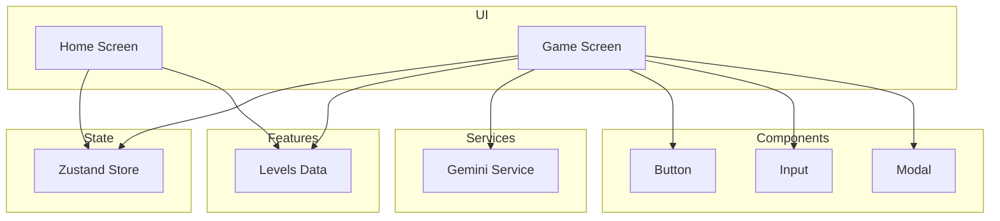
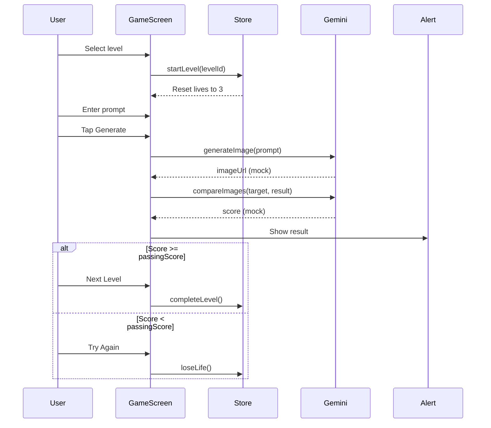

# Codebase Map

> Auto-generated by Cartographer. Last mapped: 2026-01-17

## System Overview

PromptPal is a React Native (Expo) mobile game that teaches prompt engineering through a "Say What You See" mechanic. Users analyze AI-generated images and attempt to write prompts that recreate them.



## Directory Structure

```
PromptPal/
├── src/
│   ├── app/                 # Expo Router pages
│   │   ├── _layout.tsx      # Root layout with navigation
│   │   ├── index.tsx        # Home/level select screen
│   │   └── game/
│   │       └── [id].tsx     # Dynamic game screen (takes level ID)
│   ├── components/
│   │   └── ui/              # Reusable UI components
│   │       ├── Button.tsx   # Primary button with variants
│   │       ├── Input.tsx    # Text input with label/error
│   │       ├── Modal.tsx    # Modal wrapper
│   │       └── index.ts     # Component exports
│   ├── features/
│   │   ├── game/
│   │   │   └── store.ts     # Zustand game state (lives, progress)
│   │   └── levels/
│   │       └── data.ts      # Level definitions and helpers
│   └── lib/
│       └── gemini.ts        # Gemini API service (placeholder)
├── package.json             # Dependencies
├── app.json                 # Expo config
├── tailwind.config.js       # NativeWind/Tailwind config
└── tsconfig.json            # TypeScript config
```

## Module Guide

### App Layer (`src/app/`)

**Entry point**: `index.tsx` (Expo Router entry in package.json)

| File | Purpose | Tokens |
|------|---------|--------|
| `_layout.tsx` | Root navigation layout (Stack) | 96 |
| `index.tsx` | Home screen with logo (placeholder for level select) | 164 |
| `game/[id].tsx` | Main game screen with prompt input & generation | 851 |

**Exports**: Expo Router screens

**Dependencies**:
- `expo-router` for file-based routing
- UI components from `components/ui/`
- `features/levels/data` for level data
- `features/game/store` for game state
- `lib/gemini` for image generation/scoring

**Gotchas**:
- `game/[id].tsx` uses dynamic routes - level ID comes from `useLocalSearchParams()`
- Missing level shows error screen with back button

### UI Components (`src/components/ui/`)

**Purpose**: Reusable NativeWind-styled components

| File | Purpose | Tokens |
|------|---------|--------|
| `Button.tsx` | Touchable button with variants, loading state | 394 |
| `Input.tsx` | Text input with label, error, multiline support | 283 |
| `Modal.tsx` | Modal wrapper with fade animation | 231 |
| `index.ts` | Barrel export | 24 |

**Exports**: `Button`, `Input`, `Modal`

**Dependencies**: React Native core components

**Patterns**:
- NativeWind className-based styling (Tailwind for React Native)
- Semantic color tokens (`primary`, `onPrimary`, `surface`, `error`)
- Consistent variant/size prop pattern

### Game State (`src/features/game/store.ts`)

**Purpose**: Global game state management with persistence

**Key exports**: `useGameStore` hook, `Level` interface

**Dependencies**: Zustand with persist middleware, expo-secure-store

**State shape**:
```typescript
{
  currentLevelId: string | null,
  lives: number,           // Starts at 3
  score: number,
  isPlaying: boolean,
  unlockedLevels: string[],
  completedLevels: string[]
}
```

**Actions**: `startLevel`, `endLevel`, `loseLife`, `resetLives`, `unlockLevel`, `completeLevel`, `resetProgress`

**Gotchas**:
- Uses custom SecureStore adapter for persistence (not AsyncStorage)
- First level (`level_01`) always unlocked
- Lives reset when starting a new level
- When lives reach 0, game resets to initial state

### Level Data (`src/features/levels/data.ts`)

**Purpose**: Static level definitions and lookup helpers

| File | Purpose | Tokens |
|------|---------|--------|
| `data.ts` | Level array and helper functions | 499 |

**Exports**: `LEVELS` array, `getLevelById()`, `getNextLevel()`, `getUnlockedLevels()`

**Level structure**:
```typescript
{
  id: string,
  difficulty: 'beginner' | 'intermediate' | 'advanced',
  targetImageUrl: string,
  hiddenPromptKeywords: string[],
  passingScore: number,  // Default 75
  unlocked: boolean
}
```

**Gotchas**:
- Currently uses placeholder images from picsum.photos
- In production, target images should be pre-generated and CDN-hosted
- `getUnlockedLevels()` checks the static `unlocked` field (doesn't integrate with store)

### Gemini Service (`src/lib/gemini.ts`)

**Purpose**: AI integration for image generation and scoring

| File | Purpose | Tokens |
|------|---------|--------|
| `gemini.ts` | Gemini API wrapper (placeholder implementation) | 591 |

**Key class**: `GeminiService`

**Methods** (all currently placeholder):
- `generateImage(prompt)`: Returns image URL (mock delay + random picsum image)
- `compareImages(targetUrl, resultUrl)`: Returns similarity score 0-100 (random)
- `getPromptHints(prompt)`: Returns improvement hints (static array)

**Configuration**:
```typescript
{
  apiKey: string,        // From EXPO_PUBLIC_GEMINI_API_KEY env var
  models: {
    text: 'gemini-2.5-flash',
    image: 'gemini-2.5-flash-image',
    vision: 'gemini-2.5-flash'
  }
}
```

**Gotchas**:
- All methods are placeholders with setTimeout simulation
- No actual API calls implemented yet (marked as TODO)
- API key is required but not validated

## Data Flow



### Key Flows

**Starting a level:**
1. User navigates to `/game/[id]`
2. `GameScreen` mounts and calls `startLevel()` via useEffect
3. Store resets lives to 3, sets `isPlaying: true`

**Generating & scoring:**
1. User enters prompt and taps Generate
2. `geminiService.generateImage()` called (currently mock)
3. `geminiService.compareImages()` called (currently mock)
4. Result shown in Alert dialog
5. If passing: completeLevel() and navigate back
6. If failing: loseLife() and reset for retry

## Conventions

**Styling**: NativeWind (Tailwind CSS for React Native)
- Use semantic color tokens: `bg-background`, `text-onSurface`, `text-error`
- Variants defined in `tailwind.config.js`

**State Management**: Zustand with persist
- Global store for cross-screen state (lives, progress)
- Local useState for component-specific UI state

**TypeScript**: Strict mode enabled
- Interfaces exported from their modules
- Props interfaces defined inline with components

**File naming**:
- Screens: lowercase with file extension (`index.tsx`, `[id].tsx`)
- Components: PascalCase (`Button.tsx`)
- Features: grouped by domain (`game/`, `levels/`)

## Gotchas

1. **Placeholder APIs**: All Gemini calls are mocked with random results and setTimeout delays. Real implementation requires `EXPO_PUBLIC_GEMINI_API_KEY` env var.

2. **Static unlock state**: `Level.unlocked` is hardcoded in `data.ts`. The store has `unlockLevel()` but they're not integrated - changes in store don't affect the static level data.

3. **No navigation to next level**: When passing a level, the app navigates back instead of advancing to the next level. `getNextLevel()` helper exists but isn't used.

4. **No level select UI**: The home screen (`index.tsx`) only shows a logo. There's no actual level selection UI despite the PRD describing it.

5. **SecureStore persistence**: Game state uses expo-secure-store instead of async-storage. This requires app-level permissions and won't work in Expo Go without specific config.

6. **No Nano integration**: PRD describes on-device Gemini Nano for hints, but `getPromptHints()` returns static strings. Device capability checks not implemented.

7. **Alert-based results**: Game results use React Native's Alert.alert() instead of a proper modal component, despite `Modal.tsx` being available.

## Navigation Guide

**To add a new level:** Edit `src/features/levels/data.ts`
- Add new object to `LEVELS` array
- Set unique `id`, appropriate `difficulty`, and `passingScore`
- Set `unlocked: false` (or true if it should be available)

**To implement real Gemini API:** Edit `src/lib/gemini.ts`
- Replace mock implementations in `generateImage()`, `compareImages()`, `getPromptHints()`
- Use the configured model names from `this.config.models`
- Set `EXPO_PUBLIC_GEMINI_API_KEY` in `.env` or app config

**To build level select screen:** Edit `src/app/index.tsx`
- Import `LEVELS` and `useGameStore`
- Render list of levels with lock/unlock indicators
- Navigate to `/game/{id}` on level selection
- Use `completedLevels` from store to show progress

**To add hint system:**
- Call `geminiService.getPromptHints()` when user types
- Display hints using toast or inline text
- Eventually integrate Gemini Nano with device capability check

**To implement real scoring:**
- `geminiService.compareImages()` needs to call Gemini Vision API
- Prompt should ask for similarity score 0-100 based on composition, style, subject
- Parse integer response and return
