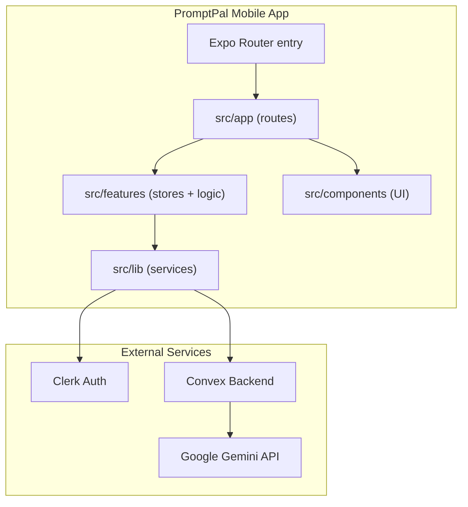

# Codebase Map

> Auto-generated by Cartographer. Last mapped: 2026-02-17. Token counts are unavailable because the cartographer scanner script is not present in this environment.

## System Overview

PromptPal is a React Native + Expo Router app. The UI is organized with file-based routing under `src/app/`, feature state is grouped under `src/features/`, and shared app services live in `src/lib/`. The app integrates Clerk authentication and Convex for backend data, with Google Gemini used through Convex mutations.

## Directory Structure

- `PromptPal/`: Main React Native + Expo app
- `docs/`: Project-level documentation (this map, plans, reports)
- `tasks/`: Work tracking and lessons learned
- `AGENTS.md`: Agent instructions
- `README.md`: Workspace overview

### PromptPal/ (app root)

- `src/app/`: Expo Router routes and layouts
- `src/features/`: Feature domains (game, achievements, onboarding, user)
- `src/components/`: Shared UI components and primitives
- `src/lib/`: App services (auth, env, networking, analytics, etc.)
- `convex/`: Convex functions and schema
- `assets/`: Images, fonts, and static assets
- `eas.json`: Build profiles and environment configuration
- `app.json`: Expo app config
- `metro.config.js`, `babel.config.js`: Metro/Babel config
- `tailwind.config.js`: NativeWind/Tailwind config

## Module Guide

### Routing (`PromptPal/src/app`)

**Purpose**: File-based routing and app layout for Expo Router.

**Key files**:
| File | Purpose |
|------|---------|
| `PromptPal/src/app/_layout.tsx` | Root layout and SAFE_MODE boot routing |
| `PromptPal/src/app/(tabs)/` | Tabbed main UI |
| `PromptPal/src/app/(auth)/` | Auth routes |
| `PromptPal/src/app/game/` | Game flow routes |
| `PromptPal/src/app/library/` | Resource library routes |

### Features (`PromptPal/src/features`)

**Purpose**: Domain logic, state stores, and feature-specific components.

**Key files**:
| File | Purpose |
|------|---------|
| `PromptPal/src/features/game/store.ts` | Game state store |
| `PromptPal/src/features/achievements/store.ts` | Achievements state store |
| `PromptPal/src/features/onboarding/` | Onboarding logic |
| `PromptPal/src/features/user/` | User profile logic |

### UI (`PromptPal/src/components`)

**Purpose**: Shared UI components and primitives.

**Key files**:
| File | Purpose |
|------|---------|
| `PromptPal/src/components/ErrorBoundary.tsx` | App error boundary |
| `PromptPal/src/components/ui/` | UI primitives (Button, Card, Modal, etc.) |

### Services (`PromptPal/src/lib`)

**Purpose**: Cross-cutting services and shared utilities.

**Key files**:
| File | Purpose |
|------|---------|
| `PromptPal/src/lib/clerk.tsx` | Clerk auth wrappers |
| `PromptPal/src/lib/convex-client.ts` | Convex client setup |
| `PromptPal/src/lib/env.ts` | Environment validation |
| `PromptPal/src/lib/network.ts` | Networking helpers |
| `PromptPal/src/lib/syncManager.ts` | Sync and background tasks |
| `PromptPal/src/lib/NormalRoot.tsx` | Full app root composition |
| `PromptPal/src/lib/GestureRoot.tsx` | GestureHandlerRootView boot mode |

### Backend (`PromptPal/convex`)

**Purpose**: Convex schema, queries, mutations, and AI integrations.

**Key files**:
| File | Purpose |
|------|---------|
| `PromptPal/convex/schema.ts` | Convex schema |
| `PromptPal/convex/queries.ts` | Queries |
| `PromptPal/convex/mutations.ts` | Mutations |
| `PromptPal/convex/ai.ts` | AI-related functions |

## Key Entry Points

- **App entry**: `PromptPal/package.json` (`main` field)
- **Router entry**: `PromptPal/src/app/_layout.tsx`
- **SAFE_MODE**: `PromptPal/src/app/_layout.tsx` (controlled by `EXPO_PUBLIC_SAFE_MODE` / `EXPO_PUBLIC_BOOT_MODE`)

## Environment Dependencies

- `EXPO_PUBLIC_CLERK_PUBLISHABLE_KEY`
- `EXPO_PUBLIC_CONVEX_URL`
- `EXPO_PUBLIC_SAFE_MODE`
- `EXPO_PUBLIC_BOOT_MODE`

## Notes

- Token counts are not computed because the Cartographer scanner script is not available in this environment.
- If the scanner becomes available, regenerate this map with updated token counts and file analysis.
