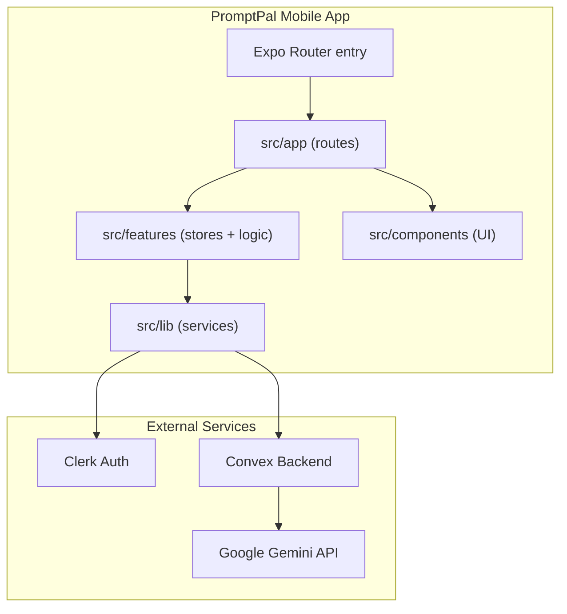
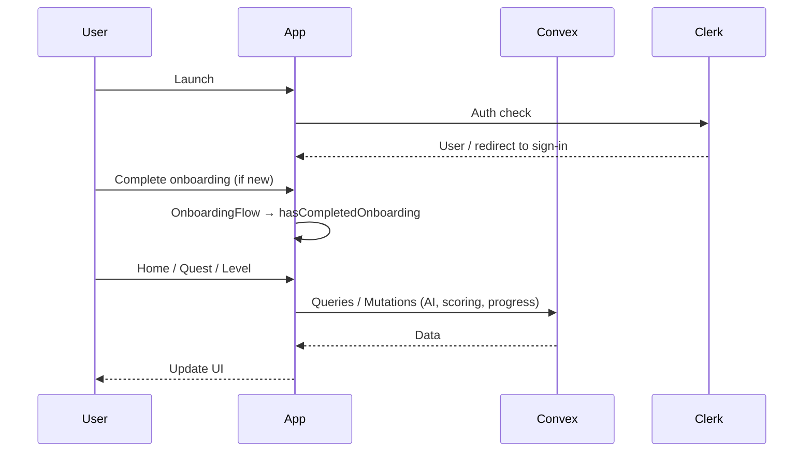

# Codebase Map

> Auto-generated by Cartographer. Last mapped: 2026-03-07. Token counts are unavailable because the cartographer scanner script is not present in this environment.

## System Overview

PromptPal is a React Native + Expo Router app. The UI is organized with file-based routing under `src/app/`, feature state is grouped under `src/features/`, and shared app services live in `src/lib/`. The app integrates Clerk authentication and Convex for backend data, with Google Gemini used through Convex mutations. Safe mode (`EXPO_PUBLIC_SAFE_MODE=1`) shows a branded `BootModeScreen` for crash isolation; otherwise the root lazy-loads `NormalRoot` (GestureHandler + Clerk + Convex + ErrorBoundary).

```mermaid
graph TB
    subgraph Client[PromptPal Mobile App]
        Entry["Expo Router entry"]
        Routes["src/app (routes)"]
        Features["src/features (stores + logic)"]
        UI["src/components (UI)"]
        Lib["src/lib (services)"]
    end

    subgraph Services[External Services]
        Clerk[Clerk Auth]
        Convex[Convex Backend]
        Gemini[Google Gemini API]
    end

    Entry --> Routes
    Routes --> UI
    Routes --> Features
    Features --> Lib
    Lib --> Clerk
    Lib --> Convex
    Convex --> Gemini
```

## Directory Structure

- `PromptPal/`: Main React Native + Expo app
- `docs/`: Project-level documentation (this map, plans, reports)
- `tasks/`: Work tracking and lessons learned
- `AGENTS.md`: Agent instructions
- `README.md`: Workspace overview

### PromptPal/ (app root)

- `src/app/`: Expo Router routes and layouts
- `src/features/`: Feature domains (game, achievements, onboarding, user, levels)
- `src/components/`: Shared UI components and primitives
- `src/lib/`: App services (auth, env, scoring, sync, analytics, etc.)
- `convex/`: Convex functions, schema, AI, rate limiting
- `assets/`: Images, fonts, and static assets
- `eas.json`: Build profiles and environment configuration
- `app.json`: Expo app config
- `metro.config.js`, `babel.config.js`: Metro/Babel config
- `tailwind.config.js`: NativeWind/Tailwind config

## Module Guide

### Routing (`PromptPal/src/app`)

**Purpose**: File-based routing and app layout for Expo Router.

**Key files**:
| File | Purpose |
|------|---------|
| `_layout.tsx` | Root layout: `EXPO_PUBLIC_SAFE_MODE=1` shows `BootModeScreen`; otherwise lazy-loads `NormalRoot` |
| `index.tsx` | Entry redirect |
| `(tabs)/_layout.tsx` | Tab layout: auth redirect, onboarding gate (`OnboardingFlow`), then Home/Library/Ranking/Profile tabs |
| `(tabs)/index.tsx` | Home: daily quest card, modules grid, usage, greeting |
| `(tabs)/library.tsx` | Library: categories, resources, user summary |
| `(tabs)/ranking.tsx` | Ranking (tab hidden via `href: null`) |
| `(tabs)/profile.tsx` | Profile |
| `(auth)/_layout.tsx` | Auth layout |
| `(auth)/sign-in.tsx` | Sign-in |
| `(auth)/sign-up.tsx` | Sign-up |
| `game/_layout.tsx` | Game stack (header hidden) |
| `game/[id].tsx` | Level picker / module hub; navigates to `game/levels/[moduleId]` |
| `game/quest/[id].tsx` | Quest flow: image/code/copy challenges, hints, scoring, attempt history |
| `game/levels/_layout.tsx` | Levels stack |
| `game/levels/[moduleId].tsx` | Module levels list |
| `library/[resourceId].tsx` | Resource detail |

### Features (`PromptPal/src/features`)

**Purpose**: Domain logic, state stores, and feature-specific components.

**Key files**:
| File | Purpose |
|------|---------|
| `game/store.ts` | Game state (lives, current level, etc.) |
| `game/components/` | TargetImageView, CopyBriefView, CodeExecutionView, CodeRequirementsView, CopyAnalysisView, PromptInputView |
| `game/utils/codeUtils.ts` | Code utilities |
| `game/levels/data.ts` | Local level definitions (used with Convex) |
| `achievements/store.ts` | Achievements state |
| `user/store.ts` | User progress, streaks, XP |
| `onboarding/store.ts` | Zustand store (SecureStore persist): steps, user inputs, results, badges, XP |
| `onboarding/OnboardingFlow.tsx` | Main flow: renders screen by `currentStep` |
| `onboarding/OnboardingOverlay.tsx` | Deprecated; re-exports `OnboardingFlow` |

**Onboarding screens** (step order: welcome → story-intro → concept-1 → practice-1 → concept-2 → practice-2 → concept-3 → practice-3 → challenge → generating → results → module-selection → complete):
| Screen | Purpose |
|--------|---------|
| `WelcomeScreen.tsx` | Welcome |
| `StoryIntroScreen.tsx` | Story intro |
| `Concept1Screen.tsx`, `Concept2Screen.tsx`, `Concept3Screen.tsx` | Concept screens |
| `Practice1Screen.tsx`, `Practice2Screen.tsx`, `Practice3Screen.tsx` | Practice screens |
| `ChallengeScreen.tsx` | Challenge |
| `GeneratingScreen.tsx` | Generating |
| `ResultsScreen.tsx` | Results |
| `ModuleSelectionScreen.tsx` | Module selection |
| `CompleteScreen.tsx` | Complete |

**Onboarding components**:
| Component | Purpose |
|-----------|---------|
| `OnboardingScreenWrapper.tsx` | Screen wrapper |
| `PromptoCharacter.tsx` | Character component |

### UI (`PromptPal/src/components`)

**Purpose**: Shared UI components and primitives.

**Key files**:
| File | Purpose |
|------|---------|
| `ErrorBoundary.tsx` | App error boundary |
| `UsageDisplay.tsx` | Usage display |
| `SignOutButton.tsx` | Sign out |
| `GoogleIcon.tsx` | Google icon |
| `ui/Button.tsx` | Button |
| `ui/Input.tsx` | Input |
| `ui/Modal.tsx` | Modal |
| `ui/Card.tsx` | Card |
| `ui/Badge.tsx` | Badge |
| `ui/ProgressBar.tsx` | Progress bar |
| `ui/RadarChart.tsx` | Radar chart |
| `ui/ResultModal.tsx` | Result modal (score, XP, feedback) |
| `ui/ResourceModal.tsx` | Resource modal |
| `ui/Skeleton.tsx` | Skeleton |
| `ui/StatCard.tsx` | Stat card |
| `ui/ResourceUtils.ts` | Resource utilities |

### Services (`PromptPal/src/lib`)

**Purpose**: Cross-cutting services and shared utilities.

**Key files**:
| File | Purpose |
|------|---------|
| `clerk.tsx` | Clerk auth wrappers |
| `convex-client.ts` | Convex HTTP client setup |
| `env.ts` | Environment validation |
| `network.ts` | Network helpers |
| `auth.ts` | Auth utilities |
| `auth-sync.tsx` | Auth sync |
| `syncManager.ts` | Sync and background tasks (game/user state, offline queue) |
| `analytics.ts` | Analytics |
| `logger.ts` | Logging |
| `gemini.ts` | Gemini API (legacy; Convex `ai.ts` preferred) |
| `nanoAssistant.ts` | Hint system, penalty details |
| `codeExecutor.ts` | Code execution |
| `BootModeScreen.tsx` | Safe-mode screen (branded shell) |
| `NormalRoot.tsx` | Full app root: GestureHandler + Clerk + Convex + SafeAreaProvider + ErrorBoundary + Stack |

**Scoring** (`src/lib/scoring/`):
| File | Purpose |
|------|---------|
| `copyScoringCore.ts` | Copy scoring core: `buildCopyAnalysisPrompt`, `parseCopyMetrics`, `calculateCopyOverallScore`, `checkRequiredElements`, `generateCopyFeedback`, `isWithinWordLimit`, `countWords` |
| `promptQuality.ts` | Prompt quality: `assessCodePromptQuality`, `assessCopyPromptQuality` (parrot penalty, checklist coverage, strategic signals) |
| `copyScoring.ts` | `CopyScoringService` (uses `copyScoringCore`) |
| `codeScoring.ts` | `CodeScoringService` |
| `imageScoring.ts` | `ImageScoringService` |

### Backend (`PromptPal/convex`)

**Purpose**: Convex schema, queries, mutations, AI integrations, and rate limiting.

**Key files**:
| File | Purpose |
|------|---------|
| `schema.ts` | Schema: users, levels, gameSessions, dailyQuests, achievements, aiGenerations, rateLimits, etc. |
| `queries.ts` | Queries: `getUserUsage`, `getLevelById`, `getLevels`, `getDailyQuestById`, etc. |
| `mutations.ts` | Mutations: `checkAndIncrementQuota`, `saveUserLevelAttempt`, `completeDailyQuest`, streak/progress updates, etc. |
| `ai.ts` | AI actions: `generateText`, `generateImage`, `evaluateImage`, `evaluateCodeSubmission`, `evaluateCopySubmission`; uses `copyScoringCore`, `promptQuality` |
| `rateLimit.ts` | `checkRateLimit`, `cleanupRateLimits`, `getRateLimitStatus` (sliding window) |
| `levels_data.ts` | Level designs (30 levels: image, code, copywriting) for seeding/reference |
| `achievements.ts` | Achievement logic |
| `analytics.ts` | Analytics |
| `auth.config.ts` | Auth config |
| `crons.ts` | Cron jobs |
| `seed.ts` | Seed script |

## Key Entry Points

- **App entry**: `PromptPal/package.json` (`main` field)
- **Router entry**: `PromptPal/src/app/_layout.tsx`
- **SAFE_MODE**: `EXPO_PUBLIC_SAFE_MODE=1` → `BootModeScreen` only
- **Normal boot**: Lazy `NormalRoot` → GestureHandler → Clerk → Convex → Stack
- **Quest flow**: `/(tabs)/` → `game/quest/[id]`
- **Level flow**: `/(tabs)/` → `game/[id]` → `game/levels/[moduleId]`

## Data Flow

```mermaid
sequenceDiagram
    participant User
    participant App
    participant Convex
    participant Clerk

    User->>App: Launch
    App->>Clerk: Auth check
    Clerk-->>App: User / redirect to sign-in
    User->>App: Complete onboarding (if new)
    App->>App: OnboardingFlow → hasCompletedOnboarding
    User->>App: Home / Quest / Level
    App->>Convex: Queries / Mutations (AI, scoring, progress)
    Convex-->>App: Data
    App-->>User: Update UI
```

## Notable Changes Since Feb 17, 2026

| Change | Location |
|--------|----------|
| **Onboarding expansion** | 12 screens, `OnboardingFlow`, `OnboardingScreenWrapper`, `PromptoCharacter`; `OnboardingOverlay` deprecated |
| **Copy scoring refactor** | `copyScoringCore.ts`, `promptQuality.ts`; `copyScoring.ts` updated |
| **Safe mode / router isolation** | Root layout + `BootModeScreen` for crash isolation; lazy `NormalRoot` |
| **Quest flow** | `game/quest/[id].tsx` for daily quest gameplay (image, code, copy) |
| **Rate limiting** | `convex/rateLimit.ts` for AI flows |
| **Bun migration** | `bun.lock` present; package manager switched from npm to Bun |

## Environment Dependencies

- `EXPO_PUBLIC_CLERK_PUBLISHABLE_KEY`
- `EXPO_PUBLIC_CONVEX_URL`
- `EXPO_PUBLIC_SAFE_MODE`

## Navigation Guide

**To add a new API endpoint**: `convex/mutations.ts` or `convex/queries.ts`; update `convex/schema.ts` if needed.

**To add a new onboarding step**: `src/features/onboarding/store.ts` (steps array), add screen in `screens/`, wire in `OnboardingFlow.tsx`.

**To add a new component**: `src/components/ui/` for shared primitives; `src/features/<feature>/components/` for feature-specific.

**To modify auth**: `src/lib/clerk.tsx`, `src/lib/auth.ts`, `convex/auth.config.ts`.

**To modify scoring**: `src/lib/scoring/copyScoringCore.ts`, `promptQuality.ts`; Convex `ai.ts` for server-side evaluation.

## Notes

- Token counts are not computed because the Cartographer scanner script is not available in this environment.
- If the scanner becomes available, regenerate this map with updated token counts and file analysis.
