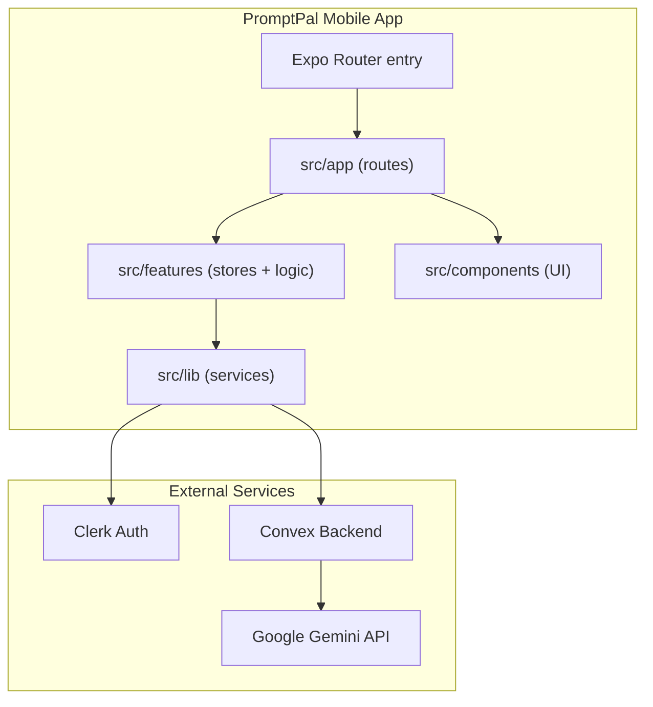
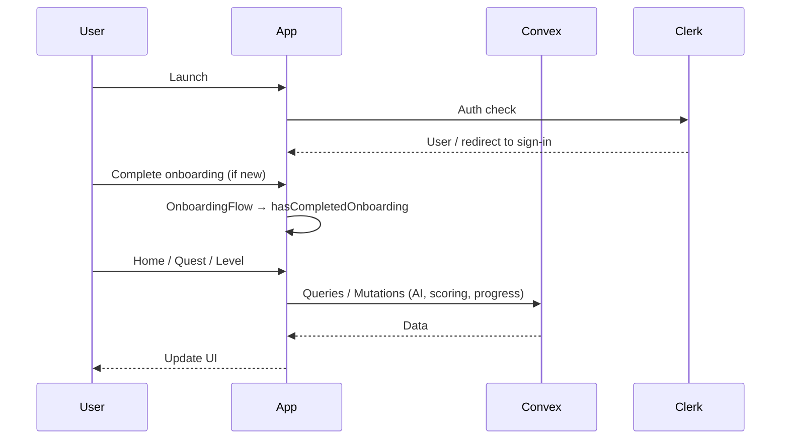

# Codebase Map

> Auto-generated by Cartographer. Last mapped: 2026-04-27.

## System Overview

PromptPal is a React Native + Expo Router app. The UI is organized with file-based routing under `src/app/`, feature state is grouped under `src/features/`, and shared app services live in `src/lib/`. The app integrates Clerk authentication and Convex for backend data, with Google Gemini used through Convex mutations. Safe mode (`EXPO_PUBLIC_SAFE_MODE=1`) shows a branded `BootModeScreen` for crash isolation; otherwise the root lazy-loads `NormalRoot` (GestureHandler + Clerk + Convex + ErrorBoundary).

```mermaid
graph TB
    subgraph Client[PromptPal Mobile App]
        Entry["Expo Router entry"]
        Routes["src/app (routes)"]
        Features["src/features (stores + logic)"]
        UI["src/components (UI)"]
        Lib["src/lib (services)"]
    end

    subgraph Services[External Services]
        Clerk[Clerk Auth]
        Convex[Convex Backend]
        Gemini[Google Gemini API]
    end

    Entry --> Routes
    Routes --> UI
    Routes --> Features
    Features --> Lib
    Lib --> Clerk
    Lib --> Convex
    Convex --> Gemini
```

## Directory Structure

- Repository root: Expo / React Native app (`src/`, `convex/`, config files) alongside `docs/`
- `docs/`: Project documentation — CODEBASE_MAP, plans/, phases/, reports/, operations/, reference/, sessions/
- `README.md`: Project overview and quick start

### Application root

- `src/app/`: Expo Router routes and layouts
- `src/features/`: Feature domains (game, achievements, onboarding, user, levels, new-ui, pre-onboarding, ranking, subscription)
- `src/components/`: Shared UI components and primitives
- `src/lib/`: App services (auth, env, scoring, sync, analytics, etc.)
- `convex/`: Convex functions, schema, AI, rate limiting, data seeding
- `__tests__/`: Unit and integration tests
- `eas.json`: Build profiles and environment configuration
- `app.json`: Expo app config
- `metro.config.js`, `babel.config.js`: Metro/Babel config
- `tailwind.config.js`: NativeWind/Tailwind config

## Module Guide

### Routing (`src/app`)

**Purpose**: File-based routing and app layout for Expo Router.

**Key files**:
| File | Purpose |
|------|---------|
| `_layout.tsx` | Root layout: `EXPO_PUBLIC_SAFE_MODE=1` shows `BootModeScreen`; otherwise lazy-loads `NormalRoot` |
| `index.tsx` | Entry redirect |
| `(tabs)/_layout.tsx` | Tab layout: auth redirect, onboarding gate, then Home/Library/Ranking/Profile tabs |
| `(tabs)/index.tsx` | Home: daily quest card, modules grid, usage, greeting |
| `(tabs)/library.tsx` | Library: categories, resources, user summary |
| `(tabs)/ranking.tsx` | Ranking (tab hidden via `href: null`) |
| `(tabs)/profile.tsx` | Profile |
| `(tabs)/cart.tsx` | Cart |
| `(auth)/_layout.tsx` | Auth layout |
| `(auth)/sign-in.tsx` | Sign-in |
| `(auth)/sign-up.tsx` | Sign-up |
| `game/_layout.tsx` | Game stack (header hidden) |
| `game/[id].tsx` | Level picker / module hub |
| `game/quest/[id].tsx` | Quest flow: image/code/copy challenges, hints, scoring |
| `game/levels/[moduleId].tsx` | Module levels list |
| `game/new-quest.tsx`, `game/quest-result.tsx`, `game/quest-nailed-it.tsx`, `game/quest-completion.tsx` | Quest state screens |
| `library/[resourceId].tsx` | Resource detail |
| `paywall.tsx` | Paywall screen |

### Features (`src/features`)

**Purpose**: Domain logic, state stores, and feature-specific components.

**Key files**:
| File | Purpose |
|------|---------|
| `game/store.ts` | Game state (lives, current level, etc.) |
| `game/components/` | TargetImageView, CopyBriefView, CodeExecutionView, CodeRequirementsView, CopyAnalysisView, PromptInputView, HtmlPreview, PromptScaffold, PracticeStyleChallenge |
| `game/utils/scaffold.ts` | Prompt scaffolding utilities |
| `game/utils/questHelp.ts` | Quest help utilities |
| `game/utils/codeUtils.ts` | Code utilities |
| `achievements/store.ts` | Achievements state |
| `user/store.ts` | User progress, streaks, XP |
| `onboarding/store.ts` | Zustand store (SecureStore persist): steps, user inputs, results, badges, XP |
| `onboarding/OnboardingFlow.tsx` | Main flow: renders screen by `currentStep` |
| `onboarding/screens/` | 15 screens: Welcome, StoryIntro, Concept1-3, Practice1-3, Challenge, Generating, Results, ModuleSelection, Complete, ExperienceScreen, ReasonForLearning |
| `levels/data.ts` | Local level definitions |
| `new-ui/` | New UI screens: Home, QuestPlay, QuestResult, QuestNailedIt, QuestCompletion |
| `new-ui/components/` | QuestNode, QuestPath, StatCapsule, FeaturedCourseCard, GamifiedTabBar, CustomIcons |
| `pre-onboarding/` | Pre-onboarding flow and screen |
| `ranking/components/StreakView.tsx` | Streak visualization |
| `subscription/store.ts` | Subscription state |

### UI (`src/components`)

**Purpose**: Shared UI components and primitives.

**Key files**:
| File | Purpose |
|------|---------|
| `ErrorBoundary.tsx` | App error boundary |
| `UsageDisplay.tsx` | Usage display |
| `SignOutButton.tsx` | Sign out |
| `GoogleIcon.tsx` | Google icon |
| `Icons.tsx` | Icon components |
| `SubscriptionAccessGuard.tsx` | Subscription access guard |
| `ui/Button.tsx` | Button |
| `ui/Input.tsx` | Input |
| `ui/Modal.tsx` | Modal |
| `ui/Card.tsx` | Card |
| `ui/Badge.tsx` | Badge |
| `ui/ProgressBar.tsx` | Progress bar |
| `ui/RadarChart.tsx` | Radar chart |
| `ui/ResultModal.tsx` | Result modal (score, XP, feedback) |
| `ui/ResourceModal.tsx` | Resource modal |
| `ui/Skeleton.tsx` | Skeleton |
| `ui/StatCard.tsx` | Stat card |
| `ui/ResourceUtils.ts` | Resource utilities |

### Services (`src/lib`)

**Purpose**: Cross-cutting services and shared utilities.

**Key files**:
| File | Purpose |
|------|---------|
| `clerk.tsx` | Clerk auth wrappers |
| `convex-client.ts` | Convex HTTP client setup |
| `env.ts` | Environment validation |
| `network.ts` | Network helpers |
| `auth.ts` | Auth utilities |
| `token-utils.ts` | Token utilities |
| `syncManager.ts` | Sync and background tasks (game/user state, offline queue) |
| `analytics.ts` | Analytics |
| `logger.ts` | Logging |
| `gemini.ts` | Gemini API helpers |
| `ai.ts` | AI error handling |
| `nanoAssistant.ts` | Hint system, penalty details |
| `codeExecutor.ts` | Code execution |
| `htmlSanitizer.ts` | HTML sanitization |
| `imageCache.ts` | Image caching |
| `sound.ts` | Sound effects |
| `animations.ts` | Animation utilities |
| `notifications.ts` | Push notifications |
| `deepLinking.ts` | Deep linking |
| `social.ts` | Social sharing |
| `subscriptions.ts` | Subscription management |
| `subscriptionShared.ts` | Shared subscription logic |
| `rateLimiter.ts` | Client-side rate limiting |
| `usage.ts` | Usage tracking |
| `thumbnails.ts` | Thumbnail generation |
| `BootModeScreen.tsx` | Safe-mode screen (branded shell) |
| `NormalRoot.tsx` | Full app root: GestureHandler + Clerk + Convex + SafeAreaProvider + ErrorBoundary + Stack |
| `oauthRedirect.ts` | OAuth redirect handling |
| `oauthRedirectCandidates.ts` | OAuth redirect candidate URLs |

**Scoring** (`src/lib/scoring/`):
| File | Purpose |
|------|---------|
| `copyScoringCore.ts` | Copy scoring core: analysis prompts, metrics parsing, overall score, element checks, feedback |
| `promptQuality.ts` | Prompt quality: code and copy prompt assessment (parrot penalty, checklist coverage) |
| `copyScoring.ts` | `CopyScoringService` |
| `codeScoring.ts` | `CodeScoringService` |
| `imageScoring.ts` | `ImageScoringService` |

**Scaffolding** (`src/lib/scaffolding/`):
| File | Purpose |
|------|---------|
| `checklistMatching.ts` | Checklist matching logic |

### Backend (`convex`)

**Purpose**: Convex schema, queries, mutations, AI integrations, rate limiting, and data seeding.

**Key files**:
| File | Purpose |
|------|---------|
| `schema.ts` | Schema: users, levels, gameSessions, dailyQuests, achievements, aiGenerations, rateLimits, etc. |
| `queries.ts` | Queries: user data, levels, quests, progress |
| `mutations.ts` | Mutations: quota, attempts, daily quests, streaks, progress |
| `ai.ts` | AI actions: generate/evaluate text, image, code, copy |
| `rateLimit.ts` | Rate limiting (sliding window) |
| `levels_data.ts` | Level designs for seeding |
| `coding_lessons_data.ts` | Coding lesson data |
| `copywriting_lessons_data.ts` | Copywriting lesson data |
| `quest_levels_data.ts` | Quest level data |
| `seed.ts` | Database seed script |
| `achievements.ts` | Achievement logic |
| `analytics.ts` | Analytics |
| `apps.ts` | App configuration |
| `rankings.ts` | Ranking logic |
| `subscriptions.ts` | Subscription handling |
| `crons.ts` | Cron jobs |
| `auth.config.ts` | Auth config |

### Tests (`__tests__`)

**Purpose**: Unit and integration tests.

**Key files**:
| File | Purpose |
|------|---------|
| `lib/rateLimiter.test.ts` | Rate limiter tests |
| `lib/codeExecutor.test.ts` | Code executor tests |
| `lib/subscriptionShared.test.ts` | Subscription shared logic tests |
| `lib/oauthRedirectCandidates.test.ts` | OAuth redirect candidates tests |
| `lib/scaffolding/checklistMatching.test.ts` | Checklist matching tests |
| `lib/scoring/promptQuality.test.ts` | Prompt quality tests |
| `lib/scoring/imageScoring.test.ts` | Image scoring tests |
| `features/game/utils/scaffold.test.ts` | Scaffold tests |
| `features/game/utils/questHelp.test.ts` | Quest help tests |
| `features/game/components/PromptInputView.test.tsx` | PromptInputView tests |
| `components/ui/Input.test.tsx` | Input component tests |

## Key Entry Points

- **App entry**: `package.json` (`main` field)
- **Router entry**: `src/app/_layout.tsx`
- **SAFE_MODE**: `EXPO_PUBLIC_SAFE_MODE=1` → `BootModeScreen` only
- **Normal boot**: Lazy `NormalRoot` → GestureHandler → Clerk → Convex → Stack
- **Quest flow**: `/(tabs)/` → `game/quest/[id]`
- **Level flow**: `/(tabs)/` → `game/[id]` → `game/levels/[moduleId]`

## Data Flow

```mermaid
sequenceDiagram
    participant User
    participant App
    participant Convex
    participant Clerk

    User->>App: Launch
    App->>Clerk: Auth check
    Clerk-->>App: User / redirect to sign-in
    User->>App: Complete onboarding (if new)
    App->>App: OnboardingFlow → hasCompletedOnboarding
    User->>App: Home / Quest / Level
    App->>Convex: Queries / Mutations (AI, scoring, progress)
    Convex-->>App: Data
    App-->>User: Update UI
```

## Notable Changes Since Last Map (2026-03-07)

| Change | Location |
|--------|----------|
| **New UI screens** | `src/features/new-ui/` with QuestNode, QuestPath, GamifiedTabBar |
| **Pre-onboarding flow** | `src/features/pre-onboarding/` |
| **Cart tab** | `src/app/(tabs)/cart.tsx` |
| **Paywall screen** | `src/app/paywall.tsx` |
| **Subscription management** | `src/lib/subscriptions.ts`, `convex/subscriptions.ts` |
| **OAuth redirect handling** | `src/lib/oauthRedirect.ts`, `src/lib/oauthRedirectCandidates.ts` |
| **Additional lesson data** | `convex/coding_lessons_data.ts`, `convex/copywriting_lessons_data.ts` |
| **Test coverage expanded** | Tests for scaffold, questHelp, PromptInputView, Input |

## Environment Dependencies

- `EXPO_PUBLIC_CLERK_PUBLISHABLE_KEY`
- `EXPO_PUBLIC_CONVEX_URL`
- `EXPO_PUBLIC_SAFE_MODE`

## Navigation Guide

**To add a new screen**: Create file in `src/app/(tabs)/` or appropriate route group

**To add a new Convex query**: Add to `convex/queries.ts` and regenerate client

**To add a new Convex mutation**: Add to `convex/mutations.ts` or `convex/ai.ts`

**To add a new feature store**: Create store in `src/features/{feature}/store.ts`

**To add a new UI component**: `src/components/ui/` for shared primitives; `src/features/<feature>/components/` for feature-specific

**To modify auth**: `src/lib/clerk.tsx`, `src/lib/auth.ts`, `convex/auth.config.ts`

**To modify scoring**: `src/lib/scoring/copyScoringCore.ts`, `promptQuality.ts`; Convex `ai.ts` for server-side evaluation

**To add tests**: Mirror source structure under `__tests__/`
