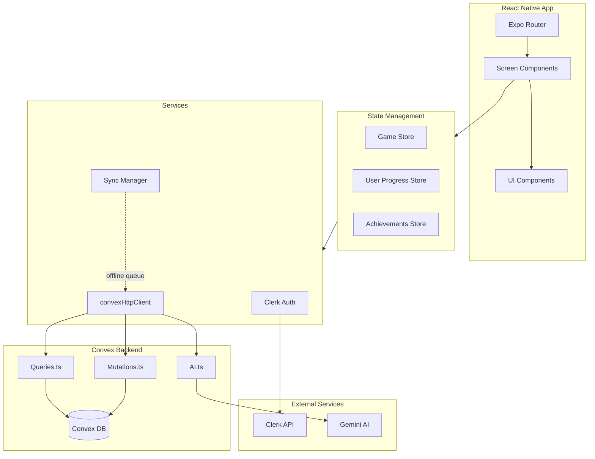
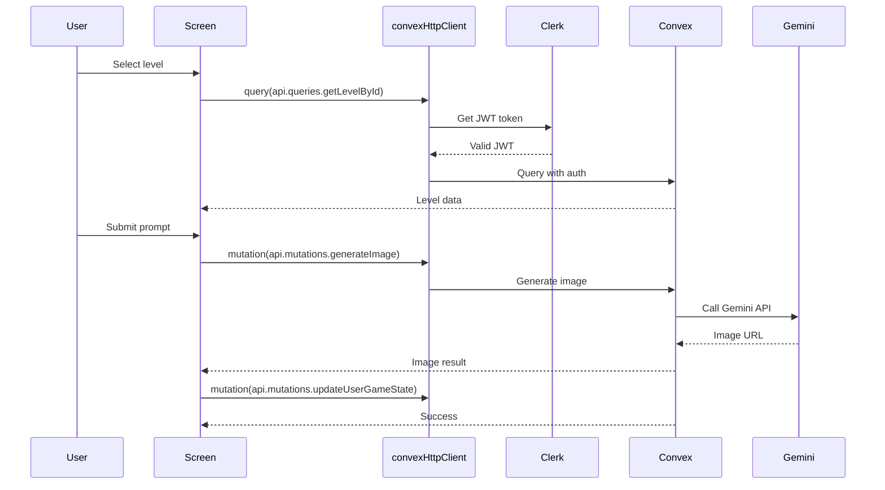

# Convex Migration Guide

> **Migration Date**: February 2026  
> **Status**: ✅ **100% COMPLETE**  
> **Migration Type**: Proxy Backend → Convex (Serverless Backend)

---

## Table of Contents

1. [Overview](#overview)
2. [What Changed](#what-changed)
3. [Architecture Changes](#architecture-changes)
4. [Developer Setup](#developer-setup)
5. [Working with Convex](#working-with-convex)
6. [Common Patterns](#common-patterns)
7. [Troubleshooting](#troubleshooting)
8. [Migration Checklist](#migration-checklist)

---

## Overview

### Why We Migrated

We moved from a custom proxy backend to **Convex** for:

- **Automatic Real-time Sync**: Data updates instantly across all clients
- **Serverless Simplicity**: No backend deployment or server management
- **Type Safety**: Full TypeScript support with generated types
- **Better Performance**: Edge-deployed functions with automatic caching
- **Offline Support**: Built-in offline queue and retry logic
- **Cost Efficiency**: Pay-as-you-go pricing vs. always-on servers

### What Was Replaced

| Before (Proxy Backend) | After (Convex) |
|------------------------|----------------|
| Custom Node.js API | Convex serverless functions |
| Axios HTTP clients | `convexHttpClient` + React hooks |
| Manual auth token management | Clerk JWT + Convex auto-auth |
| Manual caching | Convex automatic caching |
| Manual offline queue | Convex built-in offline support |
| REST endpoints (`/api/v1/...`) | Convex queries & mutations |

---

## What Changed

### Environment Variables

**Old** (`.env.example`):
```env
EXPO_PUBLIC_CLERK_PUBLISHABLE_KEY=
EXPO_PUBLIC_AI_PROXY_URL=        # ← REMOVED
EXPO_PUBLIC_API_URL=             # ← REMOVED
```

**New** (`.env.example`):
```env
CONVEX_DEPLOYMENT=               # From convex.json
EXPO_PUBLIC_CONVEX_URL=          # Your Convex deployment URL
EXPO_PUBLIC_CONVEX_SITE_URL=     # For Convex actions
EXPO_PUBLIC_CLERK_PUBLISHABLE_KEY=
CLERK_JWT_ISSUER_DOMAIN=         # For Convex auth integration
```

### API Client Changes

**Old Pattern** (❌ No longer works):
```typescript
// OLD: src/lib/unified-api.ts
import { getSharedClient } from '@/lib/unified-api';
const client = getSharedClient();
const data = await client.getLevels();
```

**New Pattern** (✅ Use this):
```typescript
// NEW: src/lib/convex-client.ts
import { convexHttpClient } from '@/lib/convex-client';
import { api } from '../../convex/_generated/api';

// In non-React contexts (services, utilities):
const data = await convexHttpClient.query(api.queries.getLevels);

// In React components:
import { useQuery } from 'convex/react';
const data = useQuery(api.queries.getLevels);
```

### Backend Changes

**Old Structure** (❌ Deleted):
```
Backend API Server (Node.js)
├── /api/v1/levels
├── /api/v1/generate-image
├── /api/v1/compare-images
└── /api/v1/leaderboard
```

**New Structure** (✅ Current):
```
Convex/
├── queries.ts          # Read operations (getLevels, getLeaderboard)
├── mutations.ts        # Write operations (updateProgress, completeLevel)
├── ai.ts              # AI operations (generateImage, evaluateImage)
├── auth.config.ts     # Clerk JWT configuration
└── _generated/        # Auto-generated types
```

---

## Architecture Changes

### System Architecture (New)



### Data Flow (New)



---

## Developer Setup

### Prerequisites

1. **Node.js 18+** installed
2. **Expo CLI** installed (`npm install -g expo-cli`)
3. **Convex CLI** installed (`npm install -g convex`)
4. **Clerk Account** (for authentication)
5. **Convex Account** (for backend)

### Step-by-Step Setup

#### 1. Clone & Install

```bash
git clone <repository-url>
cd PromptPal
npm install
```

#### 2. Set Up Environment Variables

Copy the example file:
```bash
cp .env.example .env.local
```

Fill in your values (see **Getting Your Credentials** below):

```env
# From your Convex dashboard (Settings > URL)
EXPO_PUBLIC_CONVEX_URL=https://your-team-your-project.convex.cloud

# From Clerk dashboard (API Keys)
EXPO_PUBLIC_CLERK_PUBLISHABLE_KEY=pk_test_...

# From Clerk dashboard (Configure > JWT Templates)
CLERK_JWT_ISSUER_DOMAIN=https://your-domain.clerk.accounts.dev

# Auto-generated by Convex CLI
CONVEX_DEPLOYMENT=prod:your-project:...
```

#### 3. Get Your Credentials

**Convex URL**:
1. Go to [convex.dev](https://convex.dev) dashboard
2. Select your project
3. Click **Settings** → **URL & Deployment**
4. Copy the **Deployment URL** (ends in `.convex.cloud`)

**Clerk Keys**:
1. Go to [clerk.dev](https://clerk.dev) dashboard
2. Select your application
3. Go to **API Keys**
4. Copy **Publishable Key** (starts with `pk_test_` or `pk_live_`)
5. Go to **Configure** → **JWT Templates**
6. Copy the **Issuer Domain** (e.g., `https://your-app.clerk.accounts.dev`)

#### 4. Set Up Convex Auth (One-Time)

Configure Clerk JWT verification in Convex:

1. In your Convex dashboard, go to **Settings** → **Authentication**
2. Click **Configure** on Clerk
3. Add your **Clerk Issuer Domain**
4. Save

This sets up the `CLERK_JWT_ISSUER_DOMAIN` verification.

#### 5. Generate Convex Types

```bash
npx convex dev
# This will:
# - Start the Convex dev server
# - Generate types in convex/_generated/
# - Watch for changes and auto-redeploy
```

Leave this running in a separate terminal!

#### 6. Run the App

```bash
# iOS
npm run ios

# Android
npm run android

# Web
npm run web
```

---

## Working with Convex

### Adding a New Query (Read Operation)

1. **Create the query** in `convex/queries.ts`:

```typescript
import { query } from "./_generated/server";
import { v } from "convex/values";

export const getMyData = query({
  args: {
    userId: v.string(),
    appId: v.string(),
  },
  handler: async (ctx, args) => {
    // Access database
    const data = await ctx.db
      .query("myTable")
      .withIndex("by_user", (q) => q.eq("userId", args.userId))
      .collect();
    
    return data;
  },
});
```

2. **Use in React** (auto-reactive):

```typescript
import { useQuery } from "convex/react";
import { api } from "../../convex/_generated/api";

function MyComponent() {
  const data = useQuery(api.queries.getMyData, {
    userId: "user123",
    appId: "prompt-pal"
  });
  
  if (data === undefined) return <Loading />;
  return <View>{/* render data */}</View>;
}
```

3. **Use outside React** (in services/stores):

```typescript
import { convexHttpClient } from "@/lib/convex-client";
import { api } from "../../convex/_generated/api";

const data = await convexHttpClient.query(api.queries.getMyData, {
  userId: "user123",
  appId: "prompt-pal"
});
```

### Adding a New Mutation (Write Operation)

1. **Create the mutation** in `convex/mutations.ts`:

```typescript
import { mutation } from "./_generated/server";
import { v } from "convex/values";

export const createMyData = mutation({
  args: {
    appId: v.string(),
    data: v.string(),
  },
  handler: async (ctx, args) => {
    // Get authenticated user
    const identity = await ctx.auth.getUserIdentity();
    if (!identity) throw new Error("Not authenticated");
    
    // Insert into database
    const id = await ctx.db.insert("myTable", {
      userId: identity.subject,
      appId: args.appId,
      data: args.data,
      createdAt: Date.now(),
    });
    
    return id;
  },
});
```

2. **Use in your code**:

```typescript
import { convexHttpClient } from "@/lib/convex-client";
import { api } from "../../convex/_generated/api";

// Call mutation
const result = await convexHttpClient.mutation(api.mutations.createMyData, {
  appId: "prompt-pal",
  data: "Hello World"
});
```

### AI Operations

AI operations use the Vercel AI SDK in `convex/ai.ts`:

```typescript
import { mutation } from "./_generated/server";
import { generateText } from "ai";
import { google } from "@ai-sdk/google";

export const generateResponse = mutation({
  args: { prompt: v.string() },
  handler: async (ctx, args) => {
    const result = await generateText({
      model: google("gemini-2.5-flash"),
      prompt: args.prompt,
    });
    return result.text;
  },
});
```

---

## Common Patterns

### Pattern 1: Fetching Data in Components

**With React Hooks** (Recommended for UI):
```typescript
import { useQuery } from "convex/react";
import { api } from "../../convex/_generated/api";

function LevelList() {
  const levels = useQuery(api.queries.getLevels);
  
  if (levels === undefined) return <Loading />;
  if (levels.length === 0) return <EmptyState />;
  
  return <FlatList data={levels} ... />;
}
```

**Without React Hooks** (For stores/services):
```typescript
import { convexHttpClient } from "@/lib/convex-client";
import { api } from "../../convex/_generated/api";

class MyService {
  async fetchData() {
    const data = await convexHttpClient.query(api.queries.getData);
    return data;
  }
}
```

### Pattern 2: Handling Authentication

**The client handles auth automatically** via `setAuth()`:

```typescript
// convex-client.ts
client.setAuth(async () => {
  const clerk = await import('@clerk/clerk-expo').then(m => m.Clerk);
  const session = clerk.session;
  if (!session) return null;
  return await session.getToken();
});
```

**No manual token management needed!**

### Pattern 3: Error Handling

```typescript
try {
  const result = await convexHttpClient.mutation(api.mutations.myMutation, {
    appId: "prompt-pal"
  });
} catch (error) {
  if (error.message.includes("InvalidAuthHeader")) {
    // Token expired, will auto-refresh
    logger.error("Auth error:", error);
  } else if (error.message.includes("Quota exceeded")) {
    // User hit usage limits
    showUpgradeModal();
  } else {
    // Generic error
    logger.error("Mutation failed:", error);
  }
}
```

### Pattern 4: Optimistic Updates

```typescript
// Update local state immediately
setLocalState(newValue);

// Then sync to backend
try {
  await convexHttpClient.mutation(api.mutations.updateState, {
    appId: "prompt-pal",
    value: newValue
  });
} catch (error) {
  // Revert on failure
  setLocalState(oldValue);
  logger.error("Sync failed:", error);
}
```

---

## Troubleshooting

### Issue: "InvalidAuthHeader" Error

**Symptoms**: All Convex calls fail with JWT parsing error

**Causes**:
1. Missing `CLERK_JWT_ISSUER_DOMAIN` in Convex dashboard
2. User not signed in
3. Token expired

**Fixes**:
1. Configure Clerk auth in Convex dashboard (Settings → Authentication)
2. Ensure user is signed in before making calls
3. Tokens auto-refresh, but force refresh if needed:
   ```typescript
   const { getToken } = useAuth();
   await getToken({ skipCache: true });
   ```

### Issue: "Could not find API" Error

**Symptoms**: Function not found error

**Cause**: Types not generated after adding new query/mutation

**Fix**:
```bash
npx convex dev
# or
npx convex codegen
```

### Issue: "User must be authenticated" Error

**Symptoms**: Convex returns auth error despite being signed in

**Cause**: Clerk session not properly synced with Convex

**Fix**: Check auth flow:
1. User signed in with Clerk
2. Session token valid
3. `CLERK_JWT_ISSUER_DOMAIN` matches Clerk dashboard

### Issue: Network Requests Failing

**Symptoms**: All Convex requests timeout or fail

**Checks**:
1. Is `npx convex dev` running?
2. Is `EXPO_PUBLIC_CONVEX_URL` correct?
3. Check network connectivity
4. Check Convex dashboard for deployment status

---

## Migration Checklist

Use this when migrating additional features:

- [ ] Identify old API calls (search for `getSharedClient`, `apiClient`, `axios`)
- [ ] Create equivalent Convex query/mutation in `convex/` folder
- [ ] Update imports to use `convexHttpClient` or `useQuery`
- [ ] Test authentication works (should auto-work with Clerk)
- [ ] Test error handling
- [ ] Remove old API files if no longer needed
- [ ] Update documentation

---

## Quick Reference

### File Locations

| What | Where |
|------|-------|
| Convex queries | `convex/queries.ts` |
| Convex mutations | `convex/mutations.ts` |
| Convex AI functions | `convex/ai.ts` |
| Convex auth config | `convex/auth.config.ts` |
| HTTP client | `src/lib/convex-client.ts` |
| Usage hook | `src/lib/usage.ts` |
| Generated types | `convex/_generated/api.ts` |

### Common Commands

```bash
# Start Convex dev server (required for types)
npx convex dev

# Deploy to production
npx convex deploy

# Generate types manually
npx convex codegen

# Check Convex logs
npx convex logs

# Open Convex dashboard
npx convex dashboard
```

### Environment Variables

| Variable | Required | Description |
|----------|----------|-------------|
| `EXPO_PUBLIC_CONVEX_URL` | ✅ Yes | Your Convex deployment URL |
| `EXPO_PUBLIC_CLERK_PUBLISHABLE_KEY` | ✅ Yes | Clerk public key |
| `CLERK_JWT_ISSUER_DOMAIN` | ✅ Yes | Clerk JWT issuer |
| `CONVEX_DEPLOYMENT` | ✅ Yes | Auto-generated by Convex |

---

## Support

- **Convex Docs**: [docs.convex.dev](https://docs.convex.dev)
- **Clerk Docs**: [clerk.dev/docs](https://clerk.dev/docs)
- **Team Slack**: #promptpal-dev
- **Questions?** Ask in team channel or check existing code patterns

---

**Last Updated**: February 2026  
**Migration Lead**: AI Assistant  
**Reviewed By**: Development Team
