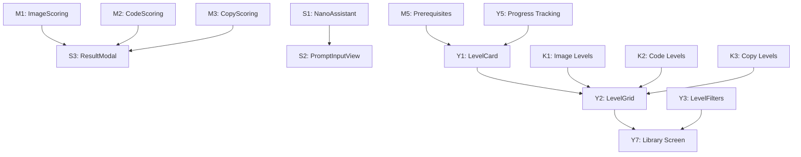

# PromptPal - Team Work Plan

> **Date:** January 25, 2026  
> **Goal:** Complete remaining ~35% of project  
> **Team:** Mikhail, Sabina, Yasar, Khalid

---

## 📊 Work Distribution Overview

| Team Member | Focus Area |
|-------------|------------|
| **Mikhail** | Scoring Services, Backend Integration, Architecture |
| **Sabina** | Game Components, Hint System, Level System |
| **Yasar** | UI Components, Level Content, Progress Tracking |
| **Khalid** | Content Creation, Polish, Assets |

---

## MIKHAIL

### Focus: Scoring Services & Backend Integration

Mikhail handles the most technically complex tasks requiring deep understanding of the AI backend optimization, and core game logic.

---

### Task M1: ImageScoringService Implementation
**Priority:** 🔥 Critical  
**Estimated Time:** 4-6 hours  
**File:** `src/lib/scoring/imageScoring.ts`

**Requirements:**
- Create scoring service that uses `AIProxyClient.compareImages()`
- Implement real similarity scoring algorithm
- Parse AI response and extract meaningful scores
- Handle edge cases (failed generation, timeout, etc.)
- Return structured feedback array

**Expected Output:**
```typescript
interface ImageScoringResult {
  score: number;           // 0-100
  similarity: number;      // Visual similarity %
  feedback: string[];      // Improvement suggestions
  keywordsMatched: string[]; // Which hidden keywords were captured
}
```

---

### Task M2: CodeScoringService Implementation
**Priority:** 🔥 Critical  
**Estimated Time:** 5-7 hours  
**File:** `src/lib/scoring/codeScoring.ts`

**Requirements:**
- Create service to evaluate generated code against test cases
- Implement syntax validation
- Create sandboxed code execution (or API call to backend)
- Run test cases and track pass/fail
- Calculate overall score based on test results

**Expected Output:**
```typescript
interface CodeScoringResult {
  score: number;
  testResults: { id: string; name: string; passed: boolean; error?: string }[];
  feedback: string[];
  syntaxValid: boolean;
}
```

---

### Task M3: CopyScoringService Implementation
**Priority:** 🔥 Critical  
**Estimated Time:** 4-5 hours  
**File:** `src/lib/scoring/copyScoring.ts`

**Requirements:**
- Create service to evaluate copywriting output
- Use AI to analyze tone, persuasion, clarity, audience fit
- Calculate word count compliance
- Check for required elements (CTA, brand mention, etc.)
- Return radar chart compatible metrics

**Expected Output:**
```typescript
interface CopyScoringResult {
  score: number;
  metrics: { label: string; value: number }[];  // TONE, PERSUASION, CLARITY, etc.
  feedback: string[];
  wordCount: number;
  withinLimit: boolean;
}
```

---

### Task M4: Backend Progress Sync
**Priority:** 🟠 High  
**Estimated Time:** 3-4 hours  
**File:** `src/lib/syncManager.ts` (update)

**Requirements:**
- Test and fix existing sync manager
- Implement conflict resolution (local vs server)
- Add offline queue for failed syncs
- Integrate with user progress store
- Add sync status indicators

---

### Task M5: Prerequisites System
**Priority:** 🟠 High  
**Estimated Time:** 3-4 hours  
**Files:** `src/features/levels/data.ts`, `src/features/game/store.ts`

**Requirements:**
- Add `prerequisites: string[]` to level definitions
- Implement `isLevelUnlocked()` function checking completed prerequisites
- Connect unlock logic to game store
- Update level selection to show locked/unlocked state

---

### Mikhail's Checklist

- [ ] M1: ImageScoringService
- [ ] M2: CodeScoringService  
- [ ] M3: CopyScoringService
- [ ] M4: Backend Progress Sync
- [ ] M5: Prerequisites System

**Total Estimated Time: 19-26 hours**

---

## SABINA

### Focus: Game Components & Hint System

Sabina handles complex UI components that require state management and integration with the scoring services.

---

### Task S1: NanoAssistant Hint System
**Priority:** 🔥 Critical  
**Estimated Time:** 4-5 hours  
**File:** `src/lib/nanoAssistant.ts`

**Requirements:**
- Create AI-powered hint system
- Generate contextual hints based on:
  - Current user prompt
  - Module type (image/code/copy)
  - Level difficulty
  - Hidden keywords (for image modules)
- Implement hint cooldown (prevent spam)
- Track hints used per level (affects scoring)

**Expected Interface:**
```typescript
class NanoAssistant {
  static async getHint(
    currentPrompt: string, 
    moduleType: 'image' | 'code' | 'copy',
    levelData: Level
  ): Promise<string>;
  
  static getHintsUsed(levelId: string): number;
}
```

---

### Task S2: PromptInputView Component
**Priority:** 🟠 High  
**Estimated Time:** 3-4 hours  
**File:** `src/features/game/components/PromptInputView.tsx`

**Requirements:**
- Standalone prompt input component
- Character and token counting
- Hint button with NanoAssistant integration
- Hint display area (collapsible list)
- Loading state during generation
- Validation feedback

---

### Task S3: Enhanced ResultModal
**Priority:** 🟠 High  
**Estimated Time:** 3-4 hours  
**File:** `src/components/ui/ResultModal.tsx` (update)

**Requirements:**
- Update to accept scoring service results
- Display similarity score for image challenges
- Show test results table for code challenges
- Show radar chart for copywriting challenges
- Add "Next Level" button when available
- Add share score functionality

---

### Task S4: TargetImageView Component
**Priority:** 🟡 Medium  
**Estimated Time:** 2-3 hours  
**File:** `src/features/game/components/TargetImageView.tsx`

**Requirements:**
- Zoomable image display
- Long-press for analysis tips
- Overlay showing "Target" badge
- Smooth transitions when switching between target/generated

---

### Task S5: CodeExecutionView Component
**Priority:** 🟡 Medium  
**Estimated Time:** 3-4 hours  
**File:** `src/features/game/components/CodeExecutionView.tsx`

**Requirements:**
- Code display with syntax highlighting (basic)
- Test case results list
- Pass/fail indicators with checkmarks/X
- Error message display
- Output console view

---

### Task S6: CopyAnalysisView Component
**Priority:** 🟡 Medium  
**Estimated Time:** 2-3 hours  
**File:** `src/features/game/components/CopyAnalysisView.tsx`

**Requirements:**
- Generated copy display
- Metrics radar chart integration
- Word count display
- Highlight matched requirements

---

### Sabina's Checklist

- [ ] S1: NanoAssistant Hint System
- [ ] S2: PromptInputView Component
- [ ] S3: Enhanced ResultModal
- [ ] S4: TargetImageView Component
- [ ] S5: CodeExecutionView Component
- [ ] S6: CopyAnalysisView Component

**Total Estimated Time: 17-23 hours**

---

## YASAR

### Focus: UI Components & Level System

Yasar handles UI components that are more straightforward and require less complex logic.

---

### Task Y1: LevelCard Component
**Priority:** 🟠 High  
**Estimated Time:** 2-3 hours  
**File:** `src/features/levels/components/LevelCard.tsx`

**Requirements:**
- Display level title, module type icon, difficulty badge
- Show completion status (completed/in-progress/locked)
- Display best score if completed
- Show XP reward
- Estimated time display
- Lock overlay for locked levels

**Props:**
```typescript
interface LevelCardProps {
  level: Level;
  progress?: LevelProgress;
  onPress: () => void;
  isDisabled?: boolean;
}
```

---

### Task Y2: LevelGrid Component
**Priority:** 🟠 High  
**Estimated Time:** 2-3 hours  
**File:** `src/features/levels/components/LevelGrid.tsx`

**Requirements:**
- FlatList/FlashList with 2-column grid
- Accept filtered level list
- Render LevelCard for each level
- Handle empty state
- Pull-to-refresh support

---

### Task Y3: LevelFilters Component
**Priority:** 🟡 Medium  
**Estimated Time:** 2-3 hours  
**File:** `src/features/levels/components/LevelFilters.tsx`

**Requirements:**
- Module filter tabs (All, Image, Code, Copy)
- Difficulty filter pills (Easy, Medium, Hard, Expert)
- Active filter state management
- Filter callback to parent

---

### Task Y4: LoadingTerminal Component
**Priority:** 🟡 Medium  
**Estimated Time:** 1-2 hours  
**File:** `src/features/game/components/LoadingTerminal.tsx`

**Requirements:**
- Animated terminal-style loading display
- Typing effect for loading messages:
  - "Analyzing prompt..."
  - "Generating image..."
  - "Comparing results..."
- Pulsing cursor
- Dark terminal aesthetic

---

### Task Y5: Per-Level Progress Tracking
**Priority:** 🟡 Medium  
**Estimated Time:** 3-4 hours  
**Files:** `src/features/user/store.ts`, `src/features/game/store.ts`

**Requirements:**
- Track per-level: bestScore, attempts, timeSpent, hintsUsed
- Update on level completion
- Persist to SecureStore
- Expose getters for progress data

**Data Structure:**
```typescript
interface LevelProgress {
  levelId: string;
  isCompleted: boolean;
  bestScore: number;
  attempts: number;
  timeSpent: number; // seconds
  hintsUsed: number;
  firstCompletedAt?: string;
}
```

---

### Task Y6: Next Level Navigation
**Priority:** 🟡 Medium  
**Estimated Time:** 1-2 hours  
**File:** `src/app/(tabs)/game/[id].tsx` (update)

**Requirements:**
- After level completion, offer "Next Level" button
- Use `getNextLevel()` function
- Handle case when no next level exists
- Unlock next level automatically on completion

---

### Task Y7: Library Screen Enhancement
**Priority:** 🟢 Low  
**Estimated Time:** 2-3 hours  
**File:** `src/app/(tabs)/library.tsx` (update)

**Requirements:**
- Show all levels using LevelGrid
- Integrate LevelFilters
- Show completion statistics
- Navigate to level on tap

---

### Yasar's Checklist

- [ ] Y1: LevelCard Component
- [ ] Y2: LevelGrid Component
- [ ] Y3: LevelFilters Component
- [ ] Y4: LoadingTerminal Component
- [ ] Y5: Per-Level Progress Tracking
- [ ] Y6: Next Level Navigation
- [ ] Y7: Library Screen Enhancement

**Total Estimated Time: 13-20 hours**

---

## KHALID

### Focus: Content Creation, Polish & Assets

Khalid handles content creation, styling, and simpler UI work that doesn't require complex logic.

---

### Task K1: Create Image Challenge Levels (5 levels)
**Priority:** 🔥 Critical  
**Estimated Time:** 3-4 hours  
**File:** `src/features/levels/data.ts` (update)

**Requirements:**
Create 5 new image generation levels:
- 2x Beginner (passingScore: 60)
- 2x Intermediate (passingScore: 70)
- 1x Advanced (passingScore: 80)

**For each level include:**
- Unique ID (e.g., `image_beginner_01`)
- Creative title
- Target image URL (use Unsplash)
- Hidden prompt keywords (5-8 per level)
- Style description
- Hints array (3 hints per level)

**Example Level Ideas:**
1. "Sunset Beach" - Beach, sunset, waves, orange sky
2. "Cyberpunk City" - Neon, rain, buildings, futuristic
3. "Mountain Lake" - Mountains, reflection, peaceful, nature
4. "Space Station" - Space, stars, technology, astronaut
5. "Ancient Temple" - Ruins, jungle, mysterious, ancient

---

### Task K2: Create Code Challenge Levels (5 levels)
**Priority:** 🔥 Critical  
**Estimated Time:** 3-4 hours  
**File:** `src/features/levels/data.ts` (update)

**Requirements:**
Create 5 new code challenge levels with test cases:
- 2x Beginner
- 2x Intermediate  
- 1x Advanced

**For each level include:**
- Unique ID
- Title
- requirementBrief (clear problem description)
- language: 'PYTHON 3.10' or 'JAVASCRIPT'
- testCases array (3-5 test cases each)
- Hints array

**Example Level Ideas:**
1. "Reverse String" - Reverse a given string
2. "Find Maximum" - Find max value in array
3. "FizzBuzz" - Classic FizzBuzz implementation
4. "Palindrome Check" - Check if string is palindrome
5. "Fibonacci" - Generate nth Fibonacci number

---

### Task K3: Create Copywriting Challenge Levels (5 levels)
**Priority:** 🔥 Critical  
**Estimated Time:** 3-4 hours  
**File:** `src/features/levels/data.ts` (update)

**Requirements:**
Create 5 new copywriting levels:
- 2x Beginner (wordLimit: 20-30)
- 2x Intermediate (wordLimit: 50-75)
- 1x Advanced (wordLimit: 100-150)

**For each level include:**
- Unique ID
- briefTitle, briefProduct, briefTarget, briefTone, briefGoal
- Target image URL (product/context image)
- metrics array template
- Hints array

**Example Level Ideas:**
1. "Fitness App Headline" - Short, punchy headline
2. "Restaurant Social Post" - Instagram caption
3. "Tech Product Description" - App store description
4. "Email Subject Line" - Newsletter opener
5. "Landing Page Hero" - Website hero section copy

---

### Task K4: CodeRequirementsView Component
**Priority:** 🟡 Medium  
**Estimated Time:** 2-3 hours  
**File:** `src/features/game/components/CodeRequirementsView.tsx`

**Requirements:**
- Display problem description in styled card
- Show language badge
- List test cases (input → expected output)
- Collapsible sections

---

### Task K5: CopyBriefView Component
**Priority:** 🟡 Medium  
**Estimated Time:** 2-3 hours  
**File:** `src/features/game/components/CopyBriefView.tsx`

**Requirements:**
- Marketing brief card layout
- Show: Product, Target Audience, Tone, Goal
- Word limit indicator
- Styled with appropriate icons

---

### Task K6: Onboarding Overlay
**Priority:** 🟢 Low  
**Estimated Time:** 3-4 hours  
**File:** `src/features/onboarding/OnboardingOverlay.tsx`

**Requirements:**
- 4-5 slide tutorial
- Explain each module type (Image, Code, Copy)
- Show hint system
- Skip button
- Progress dots
- Store "hasSeenOnboarding" flag

---

### Task K7: Enhanced Animations
**Priority:** 🟢 Low  
**Estimated Time:** 2-3 hours  
**File:** `src/lib/animations.ts`

**Requirements:**
Create reusable animation helpers:
- fadeIn
- slideUp
- pulse
- successBounce
- Use React Native Animated API

---

### Task K8: Sound Effects Setup
**Priority:** 🟢 Low  
**Estimated Time:** 1-2 hours  
**File:** `src/lib/sounds.ts`

**Requirements:**
- Create sounds manager
- Add placeholder for: success, error, button, levelComplete
- Implement enable/disable toggle
- Use expo-av

---

### Khalid's Checklist

- [ ] K1: Image Challenge Levels (5 levels)
- [ ] K2: Code Challenge Levels (5 levels)
- [ ] K3: Copywriting Challenge Levels (5 levels)
- [ ] K4: CodeRequirementsView Component
- [ ] K5: CopyBriefView Component
- [ ] K6: Onboarding Overlay
- [ ] K7: Enhanced Animations
- [ ] K8: Sound Effects Setup

**Total Estimated Time: 19-27 hours**

---

## 📅 Suggested Timeline

### Day 1 (Critical Path)
| Person | Tasks |
|--------|-------|
| Mikhail | M1: ImageScoringService |
| Sabina | S1: NanoAssistant |
| Yasar | Y1, Y2: LevelCard + LevelGrid |
| Khalid | K1: Image Levels |

### Day 2 (Core Features)
| Person | Tasks |
|--------|-------|
| Mikhail | M2: CodeScoringService |
| Sabina | S2, S3: PromptInputView + ResultModal |
| Yasar | Y3, Y4: LevelFilters + LoadingTerminal |
| Khalid | K2, K3: Code + Copy Levels |

### Day 3 (Integration)
| Person | Tasks |
|--------|-------|
| Mikhail | M3: CopyScoringService, M4: Sync |
| Sabina | S4, S5, S6: Remaining Views |
| Yasar | Y5, Y6, Y7: Progress + Navigation |
| Khalid | K4, K5: Requirement Views |

### Day 4 (Polish)
| Person | Tasks |
|--------|-------|
| Mikhail | M5: Prerequisites, Integration Testing |
| Sabina | Final integration, bug fixes |
| Yasar | Library screen, testing |
| Khalid | K6, K7, K8: Onboarding, Animations, Sounds |

---

## 🔗 Dependencies



---

## ✅ Definition of Done

A task is complete when:
1. ✅ Code compiles without errors
2. ✅ Feature works as described
3. ✅ Code follows project conventions (TypeScript, NativeWind)
4. ✅ Changes are committed with proper commit message
5. ✅ Tested on iOS/Android simulator

---

## 📞 Communication

- **Blockers:** Immediately notify Mikhail
- **Questions:** Post in team chat with task ID (e.g., "Question about S2")
- **PRs:** Tag appropriate reviewer (Mikhail reviews Sabina, Sabina reviews Yasar/Khalid)

---

*Good luck team! Let's ship this! 🚀*
