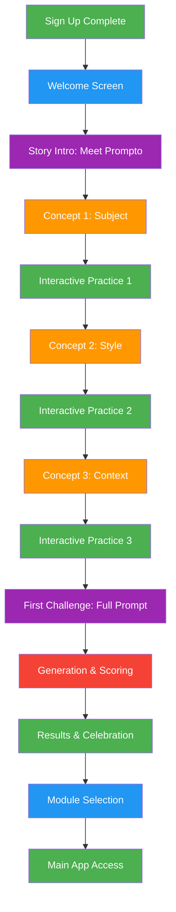

# PromptPal Onboarding Sequence Plan

**Version:** 1.0  
**Date:** January 24, 2026  
**Status:** Planning Phase

---

## 📋 Overview

The onboarding sequence is a story-driven, gamified experience that guides new users through their first level with interactive elements. The onboarding is **non-skippable** and must be completed before accessing the main app.

### Key Objectives

1. **Educate:** Teach users the core concepts of prompt engineering (Subject, Style, Context)
2. **Engage:** Create an immersive experience that hooks users from the start
3. **Guide:** Walk users through their first level with hands-on practice
4. **Motivate:** Build excitement for the learning journey ahead

### Design Philosophy

- **Story-driven:** A character guides users through the experience
- **Interactive:** Users actively participate rather than passively read
- **Gamified:** Progress tracking, achievements, and rewards
- **Non-interruptive:** Smooth flow that feels like gameplay, not a tutorial

---

## 🎭 Character Design: "Prompto"

### Character Profile

**Name:** Prompto  
**Role:** AI Prompt Mentor & Guide  
**Personality:** Friendly, encouraging, slightly quirky, knowledgeable  
**Appearance:** Animated robot/assistant character with expressive animations

### Visual Design

```
┌─────────────────────────────────────┐
│      ╭───────────────╮          │
│      │   ◉    ◉     │          │
│      │       ────       │          │
│      │      \___/       │          │
│      ╰───────────────╯          │
│                                   │
│   "Let's master prompts together!"   │
└─────────────────────────────────────┘
```

### Character Traits

- **Encouraging:** Celebrates successes, comforts failures
- **Educational:** Explains concepts simply without jargon
- **Interactive:** Responds to user actions with animations
- **Memorable:** Unique catchphrases and personality quirks

### Animation States

| State | Description | Trigger |
|--------|-------------|----------|
| Idle | Gentle breathing/bobbing | Default |
| Speaking | Mouth moves, gestures | Giving instructions |
| Excited | Bouncing, sparkles | User success |
| Thinking | Tapping chin, gears | Loading/generating |
| Celebrating | Confetti, dance | Level complete |

---

## 🎬 Onboarding Flow



---

## 📱 Screen-by-Screen Breakdown

### Screen 1: Welcome to PromptPal

**Purpose:** Welcome user and introduce the concept  
**Duration:** 10-15 seconds

#### Layout

```
┌─────────────────────────────────────┐
│                                     │
│     [Prompto Character]              │
│                                     │
│  Welcome to PromptPal! 🚀          │
│                                     │
│  I'm Prompto, your AI mentor.      │
│  Together, we'll master the art     │
│  of crafting perfect prompts.        │
│                                     │
│  [ Get Started ]                     │
│                                     │
└─────────────────────────────────────┘
```

#### Content

- **Heading:** "Welcome to PromptPal!"
- **Body:** Prompto introduces itself and the mission
- **Call to Action:** "Get Started" button

#### Interactions

- Prompto waves on screen load
- "Get Started" button with pulse animation
- Haptic feedback on button press

#### Technical Notes

```typescript
interface WelcomeScreenProps {
  onNext: () => void;
}

export function WelcomeScreen({ onNext }: WelcomeScreenProps) {
  return (
    <SafeAreaView style={styles.container}>
      <PromptoCharacter state="speaking" />
      <Text style={styles.title}>Welcome to PromptPal!</Text>
      <Text style={styles.message}>
        I'm Prompto, your AI mentor. Together, we'll master the art of crafting perfect prompts.
      </Text>
      <Pressable style={styles.button} onPress={onNext}>
        <Text style={styles.buttonText}>Get Started</Text>
      </Pressable>
    </SafeAreaView>
  );
}
```

---

### Screen 2: Story Introduction

**Purpose:** Set up the narrative and build emotional connection  
**Duration:** 15-20 seconds

#### Layout

```
┌─────────────────────────────────────┐
│                                     │
│     [Prompto with magnifying glass]   │
│                                     │
│  The Secret of Great Prompts         │
│                                     │
│  Every amazing AI creation starts    │
│  with a great prompt. But what     │
│  makes a prompt great?             │
│                                     │
│  Let me show you the three magic    │
│  ingredients... ✨                  │
│                                     │
│  [ Continue ]                       │
│                                     │
└─────────────────────────────────────┘
```

#### Content

- **Heading:** "The Secret of Great Prompts"
- **Body:** Sets up the mystery of prompt engineering
- **Teaser:** Mentions "three magic ingredients"

#### Interactions

- Prompto holds magnifying glass
- Sparkle effects around "three magic ingredients"
- Smooth transition to next screen

---

### Screen 3: Concept 1 - Subject

**Purpose:** Teach the importance of clearly identifying the subject  
**Duration:** 30-40 seconds

#### Layout

```
┌─────────────────────────────────────┐
│                                     │
│     [Prompto with pointer]            │
│                                     │
│  🎯 Ingredient 1: Subject          │
│                                     │
│  Every prompt needs a clear subject  │
│  - What are you creating?           │
│  - Who or what is the focus?        │
│                                     │
│  Example: "A cat" vs "Something"   │
│                                     │
│  [ Let's Try It! ]                 │
│                                     │
└─────────────────────────────────────┘
```

#### Content

- **Heading:** "🎯 Ingredient 1: Subject"
- **Explanation:** What is a subject and why it matters
- **Example:** Clear vs unclear subjects

#### Interactive Element

Users see two prompts and choose which has a clear subject:

```
┌─────────────────────────────────────┐
│  Which prompt has a clear subject?  │
│                                     │
│  [ A ] "Something cool"             │
│  [ B ] "A fluffy orange cat"        │
│                                     │
│  Prompto: "Think about it..."       │
└─────────────────────────────────────┘
```

#### Feedback

- **Correct:** Prompto celebrates with confetti
- **Incorrect:** Prompto gives a gentle hint

---

### Screen 4: Interactive Practice 1

**Purpose:** Hands-on practice identifying subjects  
**Duration:** 45-60 seconds

#### Layout

```
┌─────────────────────────────────────┐
│                                     │
│  [Prompto watching eagerly]          │
│                                     │
│  Your Turn! 🎮                     │
│                                     │
│  Look at this image and type a      │
│  prompt with a CLEAR subject:        │
│                                     │
│  [ IMAGE: Simple beach scene ]       │
│                                     │
│  ┌─────────────────────────────┐     │
│  │ Your prompt:               │     │
│  │ [                        ] │     │
│  └─────────────────────────────┘     │
│                                     │
│  [ Check with Prompto ]              │
│                                     │
└─────────────────────────────────────┘
```

#### Content

- **Task:** Write a prompt for a simple image
- **Image:** Beach scene (easy to describe)
- **Input:** Text field for user's prompt
- **Feedback:** Prompto analyzes and gives feedback

#### Validation Logic

```typescript
function validateSubject(prompt: string): {
  valid: boolean;
  feedback: string;
} {
  const hasSubject = /[A-Z][a-z]+/.test(prompt);
  
  if (!hasSubject) {
    return {
      valid: false,
      feedback: "I don't see a clear subject. Try adding a noun like 'beach' or 'ocean'."
    };
  }
  
  return {
    valid: true,
    feedback: "Great! You've identified the subject clearly. 🎉"
  };
}
```

#### Progress Tracking

- First concept mastery badge unlocked
- Progress bar: 33% complete

---

### Screen 5: Concept 2 - Style

**Purpose:** Teach the importance of specifying artistic style  
**Duration:** 30-40 seconds

#### Layout

```
┌─────────────────────────────────────┐
│                                     │
│     [Prompto with paintbrush]         │
│                                     │
│  🎨 Ingredient 2: Style           │
│                                     │
│  Style gives your creation its       │
│  unique look and feel:              │
│  - Art medium (painting, photo)    │
│  - Artistic style (cyberpunk, etc.) │
│  - Color palette                   │
│                                     │
│  Example: "A cat" →               │
│  "A cat in watercolor style"        │
│                                     │
│  [ Let's Try It! ]                 │
│                                     │
└─────────────────────────────────────┘
```

#### Content

- **Heading:** "🎨 Ingredient 2: Style"
- **Explanation:** What is style and how it affects output
- **Example:** Before/after comparison

#### Interactive Element

Users match styles to descriptions:

```
┌─────────────────────────────────────┐
│  Match the style to its description │
│                                     │
│  [ Cyberpunk ] → Futuristic, neon  │
│  [ Watercolor ] → Soft, painted   │
│  [ Minimalist ] → Clean, simple    │
│                                     │
│  Prompto: "You're getting it!"    │
└─────────────────────────────────────┘
```

---

### Screen 6: Interactive Practice 2

**Purpose:** Hands-on practice adding style to prompts  
**Duration:** 45-60 seconds

#### Layout

```
┌─────────────────────────────────────┐
│                                     │
│  [Prompto with art palette]          │
│                                     │
│  Add Style to Your Prompt! 🎨        │
│                                     │
│  Your previous prompt:                │
│  "A beach"                         │
│                                     │
│  Choose a style to add:             │
│                                     │
│  [ 🌅 Sunset Photography ]          │
│  [ 🎨 Watercolor Painting ]         │
│  [ 🌃 Cyberpunk Night ]            │
│  [ 📐 Minimalist Sketch ]          │
│                                     │
│  Your prompt becomes:                │
│  "A beach in watercolor painting"    │
│                                     │
│  [ Generate Preview ]                │
│                                     │
└─────────────────────────────────────┘
```

#### Content

- **Task:** Add style to previous subject prompt
- **Options:** Pre-defined style choices
- **Preview:** Shows how prompt changes
- **Action:** Generate preview image

#### AI Integration

Uses existing `generateImage` function to show preview:

```typescript
const handleGeneratePreview = async () => {
  const enhancedPrompt = `${subjectPrompt} in ${selectedStyle}`;
  const result = await generateImage({ prompt: enhancedPrompt });
  setPreviewImage(result.imageUrl);
};
```

#### Progress Tracking

- Second concept mastery badge unlocked
- Progress bar: 66% complete

---

### Screen 7: Concept 3 - Context

**Purpose:** Teach the importance of adding context and details  
**Duration:** 30-40 seconds

#### Layout

```
┌─────────────────────────────────────┐
│                                     │
│     [Prompto with lightbulb]         │
│                                     │
│  💡 Ingredient 3: Context          │
│                                     │
│  Context brings your prompt to life: │
│  - Time of day                     │
│  - Weather/Atmosphere              │
│  - Emotions/Mood                  │
│  - Camera angle/Composition         │
│                                     │
│  Example: "A cat in watercolor" → │
│  "A cat in watercolor, at sunset, │
│   feeling peaceful"                  │
│                                     │
│  [ Let's Try It! ]                 │
│                                     │
└─────────────────────────────────────┘
```

#### Content

- **Heading:** "💡 Ingredient 3: Context"
- **Explanation:** What is context and why it matters
- **Example:** Progressive improvement

#### Interactive Element

Users drag and drop context elements:

```
┌─────────────────────────────────────┐
│  Build your prompt with context:    │
│                                     │
│  Base: "A beach in watercolor"     │
│                                     │
│  Available Context:                  │
│  ┌──────────┬──────────┬──────────┐ │
│  │ 🌅 Sunset│ 🌧️ Rainy │ ☀️ Sunny │ │
│  │          │          │          │ │
│  │ 📸 Close-up│ 🏖️ Wide │ 🔭 Distant│ │
│  │          │          │          │ │
│  │ 😊 Happy │ 😢 Sad   │ 😌 Peaceful│ │
│  └──────────┴──────────┴──────────┘ │
│                                     │
│  Drop 2-3 elements here:             │
│  ┌─────────────────────────────┐     │
│  │ [ Drag elements here ]     │     │
│  └─────────────────────────────┘     │
│                                     │
│  [ Build Prompt ]                    │
└─────────────────────────────────────┘
```

---

### Screen 8: Interactive Practice 3

**Purpose:** Hands-on practice adding context to prompts  
**Duration:** 45-60 seconds

#### Layout

```
┌─────────────────────────────────────┐
│                                     │
│  [Prompto with telescope]            │
│                                     │
│  Add Context to Your Prompt! 💡       │
│                                     │
│  Your current prompt:                │
│  "A beach in watercolor painting"    │
│                                     │
│  Select context elements:             │
│                                     │
│  [☑] At sunset                    │
│  [☐] With storm clouds             │
│  [☑] Feeling peaceful              │
│  [☐] From a drone view            │
│                                     │
│  Final prompt:                      │
│  "A beach in watercolor painting,    │
│   at sunset, feeling peaceful"       │
│                                     │
│  [ Generate & Compare ]             │
│                                     │
└─────────────────────────────────────┘
```

#### Content

- **Task:** Add context elements to complete prompt
- **Options:** Multiple choice context elements
- **Preview:** Shows final prompt
- **Action:** Generate and compare with target

#### Progress Tracking

- Third concept mastery badge unlocked
- Progress bar: 100% complete
- All concepts learned badge unlocked

---

### Screen 9: First Challenge

**Purpose:** Apply all three concepts in a real challenge  
**Duration:** 2-3 minutes

#### Layout

```
┌─────────────────────────────────────┐
│                                     │
│  [Prompto with trophy]               │
│                                     │
│  🏆 Your First Challenge!           │
│                                     │
│  You've learned all three magic      │
│  ingredients. Now put them together!  │
│                                     │
│  TARGET IMAGE: [ Simple cat image ]   │
│                                     │
│  Write a prompt that includes:        │
│  ✅ Subject (what is it?)          │
│  ✅ Style (how should it look?)     │
│  ✅ Context (what's the mood?)      │
│                                     │
│  ┌─────────────────────────────┐     │
│  │ Your prompt:               │     │
│  │ [                        ] │     │
│  └─────────────────────────────┘     │
│                                     │
│  💡 Prompto's Tip:                 │
│  "Start with the subject, then      │
│   add style and context!"            │
│                                     │
│  [ Generate My Creation ]            │
│                                     │
└─────────────────────────────────────┘
```

#### Content

- **Task:** Write a complete prompt for target image
- **Requirements:** Must include subject, style, context
- **Target:** Simple, recognizable image
- **Guidance:** Prompto provides tips

#### Validation

```typescript
function validateCompletePrompt(prompt: string): {
  hasSubject: boolean;
  hasStyle: boolean;
  hasContext: boolean;
  feedback: string;
} {
  const hasSubject = /[A-Z][a-z]+/.test(prompt);
  const hasStyle = /style|painting|photo|digital|sketch/i.test(prompt);
  const hasContext = /sunset|morning|night|peaceful|happy|sad|at|during/i.test(prompt);
  
  const missing = [];
  if (!hasSubject) missing.push("subject");
  if (!hasStyle) missing.push("style");
  if (!hasContext) missing.push("context");
  
  if (missing.length > 0) {
    return {
      hasSubject: false,
      hasStyle: false,
      hasContext: false,
      feedback: `You're missing: ${missing.join(", ")}. Add them to complete your prompt!`
    };
  }
  
  return {
    hasSubject: true,
    hasStyle: true,
    hasContext: true,
    feedback: "Perfect! You've included all three ingredients! 🎉"
  };
}
```

---

### Screen 10: Generation & Scoring

**Purpose:** Show the AI generation process and scoring  
**Duration:** 30-45 seconds (waiting for generation)

#### Layout

```
┌─────────────────────────────────────┐
│                                     │
│  [Prompto with gears/sparkles]       │
│                                     │
│  Generating Your Creation... ⚡       │
│                                     │
│  ┌─────────────────────────────┐     │
│  │                           │     │
│  │   [Loading Animation]      │     │
│  │                           │     │
│  │   Analyzing prompt...       │     │
│  └─────────────────────────────┘     │
│                                     │
│  Prompto: "The AI is thinking...    │
│   This usually takes 10-30 seconds."  │
│                                     │
│  Progress: [████████░░] 80%        │
│                                     │
└─────────────────────────────────────┘
```

#### Content

- **Status:** Loading animation with progress
- **Messaging:** Prompto explains what's happening
- **Progress:** Visual progress bar

#### Loading Messages (Rotating)

1. "Analyzing your prompt..."
2. "Understanding the subject..."
3. "Applying the style..."
4. "Setting the context..."
5. "Generating your image..."
6. "Almost there..."

---

### Screen 11: Results & Celebration

**Purpose:** Show comparison, score, and celebrate completion  
**Duration:** 30-45 seconds

#### Layout

```
┌─────────────────────────────────────┐
│                                     │
│  [Prompto celebrating with confetti]   │
│                                     │
│  🎉 Amazing Work! 🎉               │
│                                     │
│  ┌──────────────┬──────────────┐     │
│  │   TARGET     │   YOURS      │     │
│  │   [Image]    │   [Image]    │     │
│  └──────────────┴──────────────┘     │
│                                     │
│  Similarity Score: 78% ⭐            │
│                                     │
│  ✅ Subject: "cat" - Perfect!      │
│  ✅ Style: "watercolor" - Great!    │
│  ✅ Context: "peaceful" - Nice!     │
│                                     │
│  Prompto: "You nailed it! Your      │
│   prompt included all three magic       │
│   ingredients perfectly!"               │
│                                     │
│  [ 🏆 Continue Journey ]             │
│                                     │
└─────────────────────────────────────┘
```

#### Content

- **Comparison:** Side-by-side target vs user image
- **Score:** Similarity percentage
- **Breakdown:** How each ingredient performed
- **Celebration:** Confetti, haptics, animations

#### Rewards Unlocked

- 🎓 "Prompt Apprentice" badge
- ⭐ First level completion
- 🎁 100 XP bonus
- 🔥 1-day streak started

---

### Screen 12: Module Selection

**Purpose:** Introduce all three modules and let user choose  
**Duration:** 30-45 seconds

#### Layout

```
┌─────────────────────────────────────┐
│                                     │
│  [Prompto with map]                 │
│                                     │
│  Choose Your Path! 🗺️              │
│                                     │
│  You've mastered the basics! Now     │
│  choose a module to continue:         │
│                                     │
│  ┌─────────────────────────────┐     │
│  │ 🖼️ Image Generation       │     │
│  │ Create images from prompts   │     │
│  │ [ Start This Module ]       │     │
│  └─────────────────────────────┘     │
│                                     │
│  ┌─────────────────────────────┐     │
│  │ 💻 Coding                 │     │
│  │ Generate code with AI       │     │
│  │ [ Start This Module ]       │     │
│  └─────────────────────────────┘     │
│                                     │
│  ┌─────────────────────────────┐     │
│  │ ✍️ Copywriting             │     │
│  │ Write persuasive copy       │     │
│  │ [ Start This Module ]       │     │
│  └─────────────────────────────┘     │
│                                     │
│  Prompto: "Each module teaches      │
│   different prompt skills. Try        │
│   them all to become a master!"      │
│                                     │
└─────────────────────────────────────┘
```

#### Content

- **Heading:** "Choose Your Path!"
- **Options:** Three module cards with descriptions
- **Guidance:** Prompto explains each module
- **Selection:** User chooses starting module

---

### Screen 13: Welcome to Main App

**Purpose:** Final transition to main app with celebration  
**Duration:** 10-15 seconds

#### Layout

```
┌─────────────────────────────────────┐
│                                     │
│  [Prompto with fireworks]            │
│                                     │
│  🎊 You're Ready! 🎊              │
│                                     │
│  You've completed your onboarding!    │
│  Welcome to PromptPal!               │
│                                     │
│  Your Progress:                      │
│  🏆 Level 1                        │
│  ⭐ 100 XP                        │
│  🔥 1-day streak                   │
│                                     │
│  Prompto: "I'll be here whenever    │
│   you need help. Let's master       │
│   prompts together!" 🚀              │
│                                     │
│  [ 🎮 Start Playing ]              │
│                                     │
└─────────────────────────────────────┘
```

#### Content

- **Celebration:** Final congratulations
- **Summary:** What user accomplished
- **Progress:** Current stats
- **Transition:** Button to main app

#### Final Rewards

- 🎓 "Onboarding Complete" badge
- 🏆 Level 1 achieved
- ⭐ 100 XP total
- 🔥 1-day streak
- 🎁 Special onboarding reward unlocked

---

## 🏗️ Technical Architecture

### State Management

Create onboarding store with Zustand:

```typescript
// src/features/onboarding/store.ts
import { create } from 'zustand';
import { persist, createJSONStorage } from 'zustand/middleware';
import AsyncStorage from '@react-native-async-storage/async-storage';

export type OnboardingStep = 
  | 'welcome'
  | 'story-intro'
  | 'concept-1'
  | 'practice-1'
  | 'concept-2'
  | 'practice-2'
  | 'concept-3'
  | 'practice-3'
  | 'challenge'
  | 'generating'
  | 'results'
  | 'module-selection'
  | 'complete';

export interface OnboardingState {
  currentStep: OnboardingStep;
  hasCompletedOnboarding: boolean;
  userPrompt: string;
  selectedStyle: string;
  selectedContext: string[];
  generatedImageUrl: string | null;
  score: number | null;
  badges: string[];
  
  // Actions
  setCurrentStep: (step: OnboardingStep) => void;
  completeOnboarding: () => void;
  setUserPrompt: (prompt: string) => void;
  setSelectedStyle: (style: string) => void;
  toggleContext: (context: string) => void;
  setGeneratedImage: (url: string) => void;
  setScore: (score: number) => void;
  addBadge: (badge: string) => void;
  resetOnboarding: () => void;
}

export const useOnboardingStore = create<OnboardingState>()(
  persist(
    (set) => ({
      currentStep: 'welcome',
      hasCompletedOnboarding: false,
      userPrompt: '',
      selectedStyle: '',
      selectedContext: [],
      generatedImageUrl: null,
      score: null,
      badges: [],
      
      setCurrentStep: (step) => set({ currentStep: step }),
      completeOnboarding: () => set({ hasCompletedOnboarding: true }),
      setUserPrompt: (prompt) => set({ userPrompt: prompt }),
      setSelectedStyle: (style) => set({ selectedStyle: style }),
      toggleContext: (context) => set((state) => ({
        selectedContext: state.selectedContext.includes(context)
          ? state.selectedContext.filter(c => c !== context)
          : [...state.selectedContext, context]
      })),
      setGeneratedImage: (url) => set({ generatedImageUrl: url }),
      setScore: (score) => set({ score }),
      addBadge: (badge) => set((state) => ({
        badges: [...new Set([...state.badges, badge])]
      })),
      resetOnboarding: () => set({
        currentStep: 'welcome',
        userPrompt: '',
        selectedStyle: '',
        selectedContext: [],
        generatedImageUrl: null,
        score: null,
      }),
    }),
    {
      name: 'promptpal-onboarding',
      storage: createJSONStorage(() => AsyncStorage),
    }
  )
);
```

### Navigation Structure

Create onboarding route:

```typescript
// src/app/(auth)/onboarding.tsx
import { useOnboardingStore } from '@/features/onboarding/store';
import { WelcomeScreen } from '@/features/onboarding/screens/WelcomeScreen';
import { StoryIntroScreen } from '@/features/onboarding/screens/StoryIntroScreen';
// ... import other screens

export default function OnboardingScreen() {
  const { currentStep, hasCompletedOnboarding } = useOnboardingStore();
  const router = useRouter();

  // Redirect to main app if onboarding complete
  useEffect(() => {
    if (hasCompletedOnboarding) {
      router.replace('/');
    }
  }, [hasCompletedOnboarding, router]);

  const renderStep = () => {
    switch (currentStep) {
      case 'welcome':
        return <WelcomeScreen />;
      case 'story-intro':
        return <StoryIntroScreen />;
      case 'concept-1':
        return <Concept1Screen />;
      case 'practice-1':
        return <Practice1Screen />;
      case 'concept-2':
        return <Concept2Screen />;
      case 'practice-2':
        return <Practice2Screen />;
      case 'concept-3':
        return <Concept3Screen />;
      case 'practice-3':
        return <Practice3Screen />;
      case 'challenge':
        return <ChallengeScreen />;
      case 'generating':
        return <GeneratingScreen />;
      case 'results':
        return <ResultsScreen />;
      case 'module-selection':
        return <ModuleSelectionScreen />;
      case 'complete':
        return <CompleteScreen />;
      default:
        return <WelcomeScreen />;
    }
  };

  return <SafeAreaView style={styles.container}>{renderStep()}</SafeAreaView>;
}
```

### Component Structure

```
src/features/onboarding/
├── store.ts                          # Zustand store for onboarding state
├── screens/
│   ├── WelcomeScreen.tsx              # Screen 1
│   ├── StoryIntroScreen.tsx           # Screen 2
│   ├── Concept1Screen.tsx            # Screen 3
│   ├── Practice1Screen.tsx           # Screen 4
│   ├── Concept2Screen.tsx            # Screen 5
│   ├── Practice2Screen.tsx           # Screen 6
│   ├── Concept3Screen.tsx            # Screen 7
│   ├── Practice3Screen.tsx           # Screen 8
│   ├── ChallengeScreen.tsx            # Screen 9
│   ├── GeneratingScreen.tsx           # Screen 10
│   ├── ResultsScreen.tsx             # Screen 11
│   ├── ModuleSelectionScreen.tsx      # Screen 12
│   └── CompleteScreen.tsx           # Screen 13
├── components/
│   ├── PromptoCharacter.tsx         # Animated character
│   ├── ProgressBar.tsx              # Progress indicator
│   ├── BadgeDisplay.tsx             # Badge showcase
│   ├── PromptBuilder.tsx            # Interactive prompt builder
│   ├── ComparisonView.tsx           # Side-by-side comparison
│   └── CelebrationOverlay.tsx       # Confetti/effects
├── hooks/
│   useOnboardingProgress.ts          # Progress tracking
│   usePromptValidation.ts           # Validation logic
│   usePromptoAnimations.ts         # Character animations
└── utils/
    ├── validation.ts                # Prompt validation functions
    ├── scoring.ts                  # Scoring algorithms
    └── rewards.ts                  # Badge/reward logic
```

### Integration with Authentication

Update sign-up flow to redirect to onboarding:

```typescript
// src/app/(auth)/sign-up.tsx
// After successful verification:
if (signUpAttempt.status === 'complete') {
  await setActive({ session: signUpAttempt.createdSessionId });
  router.replace('/(auth)/onboarding'); // Redirect to onboarding
}
```

---

## 🎨 Visual Design System

### Color Palette

```typescript
const onboardingColors = {
  primary: '#FF6B00',      // PromptPal orange
  secondary: '#4151FF',    // Blue accent
  accent: '#F59E0B',       // Gold/yellow
  success: '#4CAF50',      // Green
  info: '#2196F3',        // Light blue
  warning: '#FF9800',      // Orange
  error: '#F44336',       // Red
  
  // Backgrounds
  background: '#121212',
  surface: '#1E1E1E',
  surfaceVariant: '#2A2A2A',
  
  // Text
  onSurface: '#FFFFFF',
  onSurfaceVariant: '#B0B0B0',
  
  // Prompto character
  promptoBody: '#BB86FC',
  promptoAccent: '#03DAC6',
};
```

### Typography

```typescript
const onboardingTypography = {
  // Headings
  heading: {
    fontSize: 32,
    fontWeight: '700' as const,
    letterSpacing: -0.5,
  },
  
  // Subheadings
  subheading: {
    fontSize: 24,
    fontWeight: '600' as const,
    letterSpacing: 0,
  },
  
  // Body
  body: {
    fontSize: 16,
    fontWeight: '400' as const,
    lineHeight: 24,
    letterSpacing: 0.25,
  },
  
  // Captions
  caption: {
    fontSize: 14,
    fontWeight: '500' as const,
    letterSpacing: 0.5,
  },
};
```

### Animation Specifications

```typescript
const animations = {
  // Prompto character
  promptoIdle: {
    duration: 2000,
    easing: 'ease-in-out',
  },
  promptoSpeaking: {
    duration: 300,
    easing: 'ease-out',
  },
  promptoCelebrating: {
    duration: 1000,
    easing: 'spring',
  },
  
  // Transitions
  screenTransition: {
    duration: 400,
    easing: 'ease-in-out',
  },
  
  // Elements
  fadeIn: {
    duration: 300,
    easing: 'ease-out',
  },
  slideUp: {
    duration: 400,
    easing: 'ease-out',
  },
  
  // Celebrations
  confetti: {
    duration: 2000,
    particleCount: 100,
  },
  sparkle: {
    duration: 1500,
    particleCount: 20,
  },
};
```

---

## 🎮 Gamification Elements

### Progress Tracking

```typescript
interface OnboardingProgress {
  currentStep: number;
  totalSteps: number;
  percentage: number;
  conceptsLearned: string[];
  badgesEarned: string[];
  xpEarned: number;
}

const progress: OnboardingProgress = {
  currentStep: 5,
  totalSteps: 13,
  percentage: 38,
  conceptsLearned: ['Subject', 'Style'],
  badgesEarned: ['Subject Master', 'Style Master'],
  xpEarned: 50,
};
```

### Badge System

```typescript
const onboardingBadges = {
  'subject-master': {
    name: 'Subject Master',
    description: 'Mastered identifying subjects',
    icon: '🎯',
    rarity: 'common',
  },
  'style-master': {
    name: 'Style Master',
    description: 'Mastered adding style to prompts',
    icon: '🎨',
    rarity: 'common',
  },
  'context-master': {
    name: 'Context Master',
    description: 'Mastered adding context to prompts',
    icon: '💡',
    rarity: 'common',
  },
  'prompt-apprentice': {
    name: 'Prompt Apprentice',
    description: 'Completed first onboarding challenge',
    icon: '🎓',
    rarity: 'rare',
  },
  'onboarding-complete': {
    name: 'Onboarding Complete',
    description: 'Finished the onboarding journey',
    icon: '🏆',
    rarity: 'legendary',
  },
};
```

### Reward System

```typescript
interface OnboardingRewards {
  xp: number;
  level: number;
  streak: number;
  specialItems: string[];
}

const rewards: OnboardingRewards = {
  xp: 100,
  level: 1,
  streak: 1,
  specialItems: [
    'Prompto Avatar Frame',
    'Onboarding Theme',
    'First Challenge Trophy',
  ],
};
```

---

## ✅ Success Criteria

### Completion Checklist

- [ ] All 13 screens implemented and functional
- [ ] Prompto character animated and responsive
- [ ] All interactive elements working correctly
- [ ] AI generation integrated for challenge
- [ ] Scoring system accurate and fair
- [ ] Progress tracking updates in real-time
- [ ] Badges awarded at appropriate milestones
- [ ] Module selection redirects correctly
- [ ] Transitions smooth and polished
- [ ] Haptic feedback on all interactions
- [ ] Sound effects (optional) implemented
- [ ] Accessibility features (screen reader, reduced motion)
- [ ] Error handling for AI failures
- [ ] Loading states clear and informative
- [ ] Celebrations rewarding and satisfying

### User Experience Goals

- **Engagement:** Users complete onboarding without abandoning
- **Learning:** Users understand Subject, Style, Context concepts
- **Confidence:** Users feel ready to play the main game
- **Excitement:** Users are motivated to continue
- **Retention:** Users return to play more levels

### Metrics to Track

- Onboarding completion rate
- Time to complete onboarding
- Drop-off points (which screens lose users)
- First-day retention after onboarding
- Module selection preferences
- User satisfaction (optional survey)

---

## 🧪 Testing Plan

### Unit Tests

```typescript
// src/features/onboarding/__tests__/store.test.ts
describe('Onboarding Store', () => {
  it('should initialize with welcome step', () => {
    const { currentStep } = useOnboardingStore.getState();
    expect(currentStep).toBe('welcome');
  });
  
  it('should advance through steps', () => {
    const { setCurrentStep } = useOnboardingStore.getState();
    setCurrentStep('concept-1');
    expect(useOnboardingStore.getState().currentStep).toBe('concept-1');
  });
  
  it('should mark onboarding as complete', () => {
    const { completeOnboarding } = useOnboardingStore.getState();
    completeOnboarding();
    expect(useOnboardingStore.getState().hasCompletedOnboarding).toBe(true);
  });
});
```

### Integration Tests

```typescript
// src/features/onboarding/__tests__/flow.test.ts
describe('Onboarding Flow', () => {
  it('should complete full onboarding flow', async () => {
    const { result } = render(<OnboardingScreen />);
    
    // Step through all screens
    await pressButton(result, 'Get Started');
    await pressButton(result, 'Continue');
    // ... continue through all steps
    
    // Verify completion
    expect(useOnboardingStore.getState().hasCompletedOnboarding).toBe(true);
  });
});
```

### Manual Testing Checklist

- [ ] Complete onboarding on iOS device
- [ ] Complete onboarding on Android device
- [ ] Test on different screen sizes
- [ ] Verify all animations play smoothly
- [ ] Test AI generation in challenge
- [ ] Verify scoring accuracy
- [ ] Test error handling (network issues)
- [ ] Verify badge awards
- [ ] Test module selection redirects
- [ ] Verify progress persistence
- [ ] Test accessibility features
- [ ] Verify haptic feedback
- [ ] Test on slow network
- [ ] Verify no memory leaks

---

## 📅 Implementation Timeline

### Phase 1: Foundation (2-3 hours)

- [ ] Create onboarding store with Zustand
- [ ] Set up navigation structure
- [ ] Create base screen components
- [ ] Implement Prompto character component
- [ ] Set up progress tracking

### Phase 2: Content Screens (4-5 hours)

- [ ] Implement Welcome Screen
- [ ] Implement Story Intro Screen
- [ ] Implement Concept 1 Screen
- [ ] Implement Practice 1 Screen
- [ ] Implement Concept 2 Screen
- [ ] Implement Practice 2 Screen
- [ ] Implement Concept 3 Screen
- [ ] Implement Practice 3 Screen

### Phase 3: Challenge & Results (3-4 hours)

- [ ] Implement Challenge Screen
- [ ] Implement Generating Screen
- [ ] Implement Results Screen
- [ ] Integrate AI generation
- [ ] Implement scoring logic
- [ ] Add celebration effects

### Phase 4: Completion (2-3 hours)

- [ ] Implement Module Selection Screen
- [ ] Implement Complete Screen
- [ ] Add badge system
- [ ] Implement reward system
- [ ] Connect to main app

### Phase 5: Polish (2-3 hours)

- [ ] Add animations and transitions
- [ ] Implement haptic feedback
- [ ] Add sound effects (optional)
- [ ] Polish visual design
- [ ] Optimize performance
- [ ] Add accessibility features

### Phase 6: Testing (1-2 hours)

- [ ] Write unit tests
- [ ] Write integration tests
- [ ] Manual testing on devices
- [ ] Fix bugs and issues
- [ ] Final polish

**Total Estimated Time:** 14-20 hours

---

## 🚀 Next Steps

1. **Review this plan** with team/stakeholders
2. **Approve the design** and character concept
3. **Switch to Code mode** to begin implementation
4. **Iterate based on feedback** during development
5. **Test thoroughly** before release
6. **Monitor metrics** after launch for improvements

---

## 📝 Notes & Considerations

### Future Enhancements

- Add more onboarding paths for different user types
- Implement adaptive difficulty based on user performance
- Add more interactive mini-games
- Create additional Prompto character variants
- Add voiceover for accessibility
- Implement localized versions

### Potential Risks

- **AI Generation Time:** Long waits may frustrate users
  - *Mitigation:* Entertaining loading messages, progress bar
- **Network Issues:** Users may have poor connectivity
  - *Mitigation:* Graceful error handling, retry options
- **Complexity:** Too many steps may overwhelm users
  - *Mitigation:* Keep explanations simple, use visuals
- **Device Limitations:** Older devices may struggle with animations
  - *Mitigation:* Provide reduced motion option

### Success Indicators

- 80%+ completion rate for new users
- 70%+ first-day retention
- Positive user feedback on onboarding experience
- Users successfully complete first challenge
- Module selection shows balanced distribution

---

**Document Status:** Ready for Review  
**Next Action:** Awaiting stakeholder approval to proceed with implementation
